# Procurement Management System — User Journey Documentation

**Document version:** 1.0
**Date:** 2026-07-27
**Status of the system analysed:** Functional UI template (pre-backend)
**Source of truth:** The implementation under `src/`, as committed at `0646c19`

---

# Overview

## What this document is

This is a description of the Procurement Management System **as it exists today**, written from the code rather than from a specification. Every screen, action, link, and piece of logic described below was traced in the source. Where the UI implies behaviour that is not implemented, this document says so explicitly rather than describing the intent as if it were real.

Recommendations are additive. Nothing here proposes replacing the existing navigation model, page layouts, component library, or visual language.

## What the system is

A single-module procurement workspace for **MK Themed Attractions Phils.**, covering the path from a purchase request through vendor canvassing to proof of delivery. It is built as a Next.js 16 App Router application using React 19, Tailwind v4, and a shadcn/Base UI component layer.

The domain model in `src/lib/types.ts` is the clearest statement of the intended business process:

> Purchase requests move Draft → Canvassing / PO Created → Partially Completed → Completed, with Rejected as an off-ramp. **Items within a single request can be sourced independently**, so status lives on both the request and its individual items.

That per-item independence is the defining characteristic of this system and it is genuinely reflected in the UI: a single PR can simultaneously have one item delivered, one item with a PO open, and one item still out for quotes.

## Current maturity

| Layer | State | Evidence |
|---|---|---|
| Routing & navigation | **Implemented** | 12 routes, sidebar, breadcrumbs, all wired |
| Page layouts & components | **Implemented** | Consistent `PageHeader` / `Card` / `Table` system |
| Domain model | **Implemented** | `src/lib/types.ts`, fully typed |
| Seed data | **Implemented** | 10 PRs, 6 canvassing cases, 3 ICRs, 4 users, 5 reports |
| Client-side interactivity | **Partial** | 7 components hold real state; the rest are static |
| Search | **Partial** | Global search works; per-page filters do not |
| Persistence | **Not implemented** | No API, no database, no server actions |
| Authentication | **Not implemented** | Login form navigates to `/dashboard` unconditionally |
| Authorisation / RBAC | **Not implemented** | Roles are descriptive copy only |
| Loading / error / 404 states | **Not implemented** | No `loading.tsx`, `error.tsx`, or `not-found.tsx` anywhere |

## Reading guide

Throughout this document:

- **Works** — the behaviour is implemented and observable.
- **Visual only** — the control renders but has no handler, or navigates to a fixed mock destination.
- **Broken** — the control leads to a route that does not resolve, or contradicts adjacent copy.
- **Assumption** — inferred, not evidenced in code. All assumptions are collected in the [Assumptions](#assumptions) section.

---

# Current Navigation Structure

## Route inventory

Twelve routes exist. Two of them are redirects.

| # | Route | Type | File | Rendering |
|---|---|---|---|---|
| 1 | `/` | Redirect → `/dashboard` | `app/page.tsx` | Server |
| 2 | `/login` | Page | `app/(auth)/login/page.tsx` | Server |
| 3 | `/dashboard` | Page | `app/(dashboard)/dashboard/page.tsx` | Server |
| 4 | `/purchase-requests` | List | `.../purchase-requests/page.tsx` | Server, reads `?view` |
| 5 | `/purchase-requests/new` | Form | `.../purchase-requests/new/page.tsx` | Server shell + client editor |
| 6 | `/purchase-requests/[id]` | Detail | `.../purchase-requests/[id]/page.tsx` | Static (10 params) |
| 7 | `/purchase-requests/item-requests` | List | `.../item-requests/page.tsx` | Server |
| 8 | `/canvassing` | List | `.../canvassing/page.tsx` | Server |
| 9 | `/canvassing/[id]` | Detail | `.../canvassing/[id]/page.tsx` | Static (**1 param**) |
| 10 | `/canvassing/[id]/quotes/new` | Form | `.../quotes/new/page.tsx` | Static (**1 param**) |
| 11 | `/reports` | Workspace | `.../reports/page.tsx` | Server shell + client workspace |
| 12 | `/settings` | Redirect → `/settings/account` | `.../settings/page.tsx` | Server |
| 13 | `/settings/account` | Form | `.../settings/account/page.tsx` | Server |
| 14 | `/settings/users` | List | `.../settings/users/page.tsx` | Server |

> **Note on 9 and 10:** `generateStaticParams` for both canvassing routes iterates `canvassingDetails`, which contains exactly **one** entry — `PR-2026-0113`. Every other canvassing link in the application resolves to `notFound()`. This is the single largest navigational defect in the build and is detailed in [UX Issues](#ux-issues).

## Layout hierarchy

```
RootLayout                          app/layout.tsx
├── TooltipProvider
│
├── (auth) group  — no chrome
│   └── /login                      centred card on muted background
│
└── (dashboard) group               app/(dashboard)/layout.tsx
    ├── SidebarProvider
    ├── AppSidebar                  collapsible="icon", becomes Sheet on mobile
    │   ├── SidebarHeader           org identity → /dashboard
    │   ├── SidebarContent          NavMain (4 items)
    │   ├── SidebarFooter           NavUser dropdown
    │   └── SidebarRail             drag-to-collapse
    └── SidebarInset  (= <main>)
        ├── SiteHeader              sticky, h-16 (h-12 when sidebar collapsed)
        │   ├── SidebarTrigger
        │   ├── DashboardBreadcrumbs
        │   ├── GlobalSearch
        │   └── NotificationsMenu
        └── <div> content well      gap-6, p-4 → md:p-6
            └── {children}
```

The settings section adds a second, nested layout (`settings/layout.tsx`) with its own `PageHeader` and a `SettingsNav` side rail — a 4-column grid that collapses to stacked on mobile.

## Primary navigation (sidebar)

Defined in `src/data/navigation.ts`:

| Label | URL | Icon | Active-state rule |
|---|---|---|---|
| Dashboard | `/dashboard` | `LayoutDashboardIcon` | exact or prefix |
| Purchase Requests | `/purchase-requests` | `ClipboardListIcon` | exact or prefix |
| Canvassing | `/canvassing` | `UsersIcon` | exact or prefix |
| Reports | `/reports` | `ChartColumnIcon` | exact or prefix |

`NavMain` supports collapsible sub-items, but **no nav item currently declares `items`**, so every entry renders as a flat link. The collapsible branch is dead code today.

**Settings is not in the sidebar.** It is reachable only through the user dropdown in the sidebar footer. This was a deliberate recent change (commit `0646c19 chore: remove second nav`).

## Secondary navigation

| Mechanism | Where | Behaviour |
|---|---|---|
| **Breadcrumbs** | Header, all dashboard routes | Derived from `usePathname()`. Static segments get friendly labels from `breadcrumbLabels`; unmatched segments (record IDs) render raw. `quotes` is suppressed via `hiddenBreadcrumbSegments`. All but the last crumb are hidden below `md`. |
| **Global search** | Header | Client-side substring match over a 10-record static index. Grouped by type, capped at 3 per group. |
| **Notifications** | Header | Popover, 5 seed items in Today/Earlier groups, unread badge. |
| **User menu** | Sidebar footer | My Account, Settings (both → `/settings/account`), Log Out (→ `/login`). |
| **Settings nav** | `/settings/*` | Two-item rail: My Account, Users & Roles (Admin). |
| **In-page cross-links** | Throughout | PR ↔ Canvassing ↔ Item Requests; dashboard tables → PR detail. |

## Navigation map

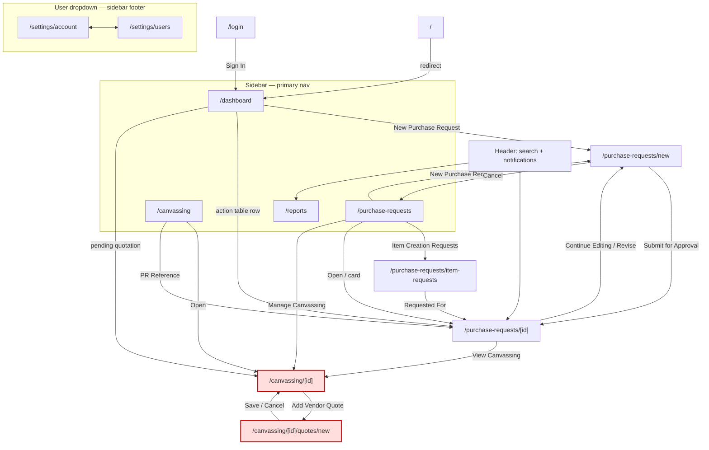

*Red nodes resolve only for `PR-2026-0113`; all other IDs 404.*

---

# Current User Flows

Five workflows are implemented end to end (with the caveats noted). They are described here in the order a user encounters them.

---

## Flow 1 — Sign in

| Aspect | Detail |
|---|---|
| **Goal** | Reach the application workspace. |
| **Entry point** | `/login` directly, or the Log Out item in the user menu. |
| **Screens** | `/login` → `/dashboard` |
| **User actions** | Enter email, enter password, optionally uncheck "Keep me signed in", press Sign In. |
| **System responses** | Browser-native `required` validation on both fields. On pass, the form performs a **GET navigation to `/dashboard`** (`<form action="/dashboard">`). Credentials are submitted as query parameters and discarded. |
| **Decision points** | None. There is no branch — any input that satisfies `type="email"` and non-empty password proceeds. |
| **Success outcome** | Dashboard renders. |
| **Failure scenarios** | Only the two native "please fill in this field" bubbles. There is no invalid-credentials path, no lockout, no server error path, no loading state. |
| **Exit points** | Dashboard; "Forgot password?" (→ `/login`, i.e. reloads itself). |

**Status: Visual only.** No authentication exists. `/dashboard` and every other route are directly reachable without visiting `/login`. There is no middleware, no session, no route protection.

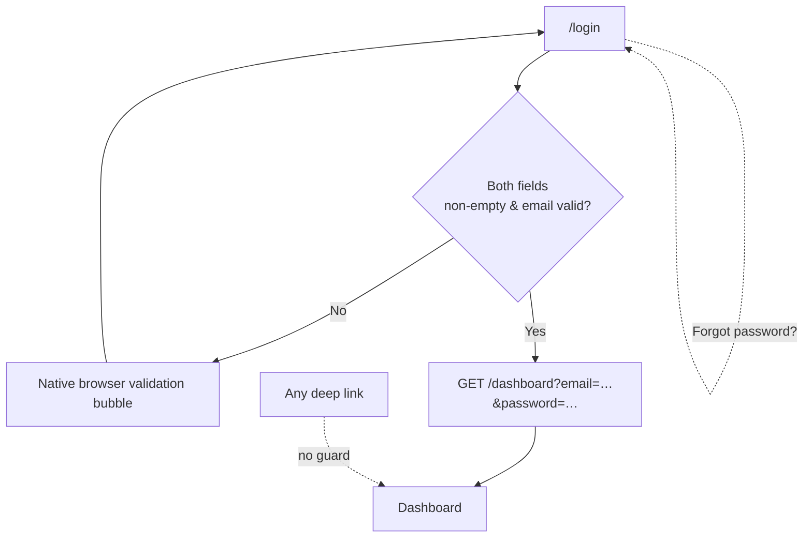

---

## Flow 2 — Triage the daily workload

| Aspect | Detail |
|---|---|
| **Goal** | Understand what needs attention and open the right record. |
| **Entry point** | `/` redirect, sidebar Dashboard, org logo, or post-login. |
| **Screens** | `/dashboard` → PR detail / canvassing detail |
| **User actions** | Scan 5 KPI tiles → scan "Requests Requiring Action" (6 rows) → click a PR number, or click a pending quotation, or scan recent activity / deadlines. |
| **System responses** | All content is static server-rendered. No refresh, no polling, no drill-down from KPI tiles. |
| **Decision points** | Which request to open. The `Step` column carries the decision signal ("PO Created — proof needed", "Comparison Ready — needs vendor selection", "Exemption Approval Needed"). |
| **Success outcome** | User lands on the record that needs work. |
| **Failure scenarios** | Two of the three "Pending Quotations" links (`PR-2026-0108`, `PR-2026-0112`) resolve to a 404. |
| **Exit points** | PR detail, canvassing detail, New PR form, any sidebar destination. |

**Notable:** the dashboard is the only screen with a genuine cross-workflow overview, and it is read-only. Every action it offers is "go somewhere else".

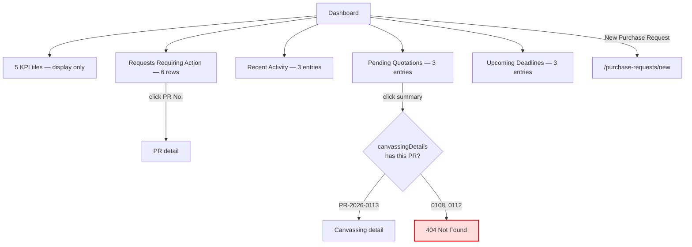

---

## Flow 3 — Create and submit a purchase request

This is the richest implemented flow and the one with the most working client-side logic.

| Aspect | Detail |
|---|---|
| **Goal** | Capture what needs buying and route it for approval. |
| **Entry point** | "New Purchase Request" button on Dashboard or PR list; "Continue Editing" on a draft PR; "Revise & Resubmit" on a rejected PR. |
| **Screens** | `/purchase-requests/new` → `/purchase-requests/PR-2026-0117` |
| **User actions** | (1) Fill request details — optional title, department, date needed, priority, justification. (2) Edit line items — pick catalog items, set quantity, adjust estimated unit cost, choose a vendor on Direct lines, add/remove rows. (3) Optionally attach files. (4) Read the "Before you submit" checklist and approval-routing preview. (5) Save as Draft **or** Submit for Approval **or** Cancel. |
| **System responses** | Line item totals and the grand total recompute live. Selecting a catalog item auto-fills unit and estimated unit cost, and **derives** the sourcing mode. Selecting nothing marks the row "Item not found in catalog" with an inline link to Item Creation Requests. |
| **Decision points** | Item in catalog or not; Direct vs Canvassing sourcing (**see defect below**); draft vs submit. |
| **Success outcome** | Navigates to `PR-2026-0117` detail — a **fixed** destination regardless of what was entered. |
| **Failure scenarios** | None surfaced. No field is marked required, no validation runs on submit, nothing is persisted. |
| **Exit points** | PR detail (submit), PR list (cancel), Item Creation Requests (inline link — **loses all entered data**). |

### Implemented business logic in the line-item editor

`src/components/purchase-requests/line-items-editor.tsx` contains real, working rules:

| Rule | Implementation |
|---|---|
| Catalog lookup | `catalogItems.find(item => item.name === itemName)` |
| Auto-fill on select | Sets `unit` and `unitCost` from the catalog entry |
| Sourcing derivation | Catalog hit → `"canvassing"`; catalog miss → `"pending-item-creation"` |
| Vendor field gating | Vendor `<Select>` renders **only** when `sourcing === "direct"`; otherwise shows "Empty — set during canvassing" |
| Line total | `quantity × unitCost`, or `"Pending"` when cost is null |
| Grand total | Sum of all line totals, nulls treated as 0 |
| Row management | Add appends a blank canvassing row; remove filters by key |
| Non-catalog treatment | Warning-toned dashed cell + "Request New Item →" link |

### Defect: the "Canvass?" toggle described in the checklist does not exist

The "Before you submit" panel states:

> Toggle "Canvass?" off for an item to pick its vendor now and skip canvassing for that line; leave it on to route that item into the canvassing stage instead.

There is **no such toggle** in `LineItemsEditor`. `sourcing` is set only by `selectItem()`, which can produce `"canvassing"` or `"pending-item-creation"` — never `"direct"`. The single Direct row visible on load is hard-coded in `initialLines`, and the moment a user re-selects its item, it flips to Canvassing and its chosen vendor is cleared with no warning.

Compounding this, the editor's own legend says sourcing is "determined automatically, not editable here" — which directly contradicts the checklist copy sitting one column to the right.

**Impact:** the user cannot perform the single most consequential decision on this screen — whether an item skips canvassing. Two adjacent pieces of UI copy tell them opposite things about whether they can.

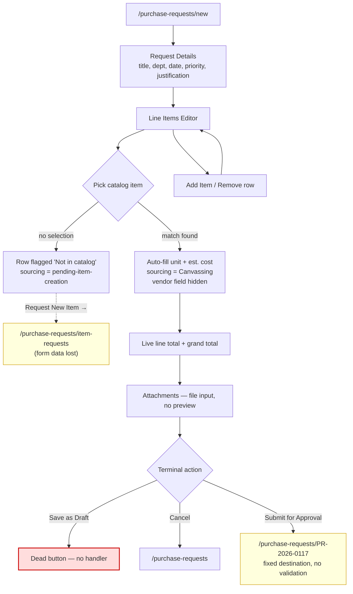

---

## Flow 4 — Run canvassing and select a vendor

| Aspect | Detail |
|---|---|
| **Goal** | Gather at least three vendor quotes for a batch of items and award the work. |
| **Entry point** | Sidebar → Canvassing; "Manage Canvassing" on a PR card; "View Canvassing — Batch N" in a PR's action panel; "View Canvassing →" on a PR item row; dashboard Pending Quotations. |
| **Screens** | `/canvassing` → `/canvassing/[id]` → `/canvassing/[id]/quotes/new` → back to `/canvassing/[id]` |
| **User actions** | (1) Scan the canvassing list — 6 rows across 5 PRs, batch-tagged. (2) Open a case. (3) In the Batch Builder, tick items to group. (4) Add a vendor quote — vendor, reference, date, delivery estimate, payment terms, per-item unit prices, document upload. (5) In the Batch Comparison, pick a radio row and confirm the winner. |
| **System responses** | Batch Builder tracks selection and counts it. Quote form computes line and grand totals live. Comparison table computes and highlights the **lowest** quote in success green and pre-selects it. Batches with a confirmed winner collapse to a read-only summary card. |
| **Decision points** | Which items belong in a batch; which vendor wins; whether the 3-quote minimum is met or exempted. |
| **Success outcome** | Intended: batch moves to Vendor Selected → PO creation. Actual: the "Confirm Vendor Selection" button has no handler. |
| **Failure scenarios** | Opening any canvassing case other than `PR-2026-0113` returns a 404. |
| **Exit points** | Canvassing list, PR detail, quote form. |

### The batching concept

This is the most sophisticated idea in the product and it is well modelled. Items on one PR can be split into separate batches, each canvassed and awarded independently. `PR-2026-0113` demonstrates all four states at once:

| Item | Batch | State |
|---|---|---|
| Steel drum pallets (48in) | 1 | Comparison Ready — 4 quotes in |
| Stretch wrap film | 1 | Comparison Ready — same batch |
| Corner edge protectors | 2 | Vendor Selected — Pacific Fasteners, ₱9,400 |
| Pallet wrap dispenser | — | Awaiting Batch Assignment |

The canvassing **list** shows this as four separate rows sharing a background tint, with an explanatory footnote. The canvassing **detail** shows it as one Batch Builder table plus one section per batch.

### Implemented logic

| Rule | Where | Behaviour |
|---|---|---|
| Lowest-quote detection | `batch-comparison.tsx` | `reduce` over quotes; winner styled `text-status-success` and bolded |
| Default selection | `batch-comparison.tsx` | Pre-selects `selectedVendorId ?? lowest.id` — a sensible nudge |
| Won-batch collapse | `canvassing/[id]/page.tsx` | If `selectedVendorId` is set, renders a 4-metric summary instead of a comparison table |
| Quote-count status | `batch-comparison.tsx` | Tone flips neutral/info at `quotes.length >= quotesRequired` |
| "Lowest so far" | `quotes/new/page.tsx` | Right rail shows current cheapest for the batch |
| Live quote totals | `quote-form.tsx` | `quantity × unitPrice` per line, summed |
| Exemption display | `canvassing/page.tsx` | Renders "1 / 1 (exempted)" instead of "minimum" |

### Defects in this flow

1. **Batch Builder selection is discarded.** The "Create Quotation for Selected Items →" button links to `/canvassing/[id]/quotes/new` with **no `?batch=` parameter**, so the quote form falls back to `batchNumber = 1`. Whatever the user ticked is ignored. Meanwhile, the "+ Add Vendor Quote" button inside each batch section *does* pass `?batch=N` correctly — so two buttons that look equivalent behave differently.
2. **The builder's footer copy admits the gap**: "3 items selected — not yet grouped into an active batch". There is no way to actually create a batch.
3. **"Confirm Vendor Selection" is inert.** No `onClick`. The radio selection is local state that evaporates on navigation.
4. **"Save Quote" is a `<Link>`,** not a submit. No validation, no persistence, and the required vendor/date fields can be entirely blank.
5. **The exemption workflow has no screen.** `PR-2026-0112` shows status "Pending Exemption Approval" and its action panel says an exemption is needed before a PO can be created — but nothing anywhere lets a user request, review, approve, or reject one.

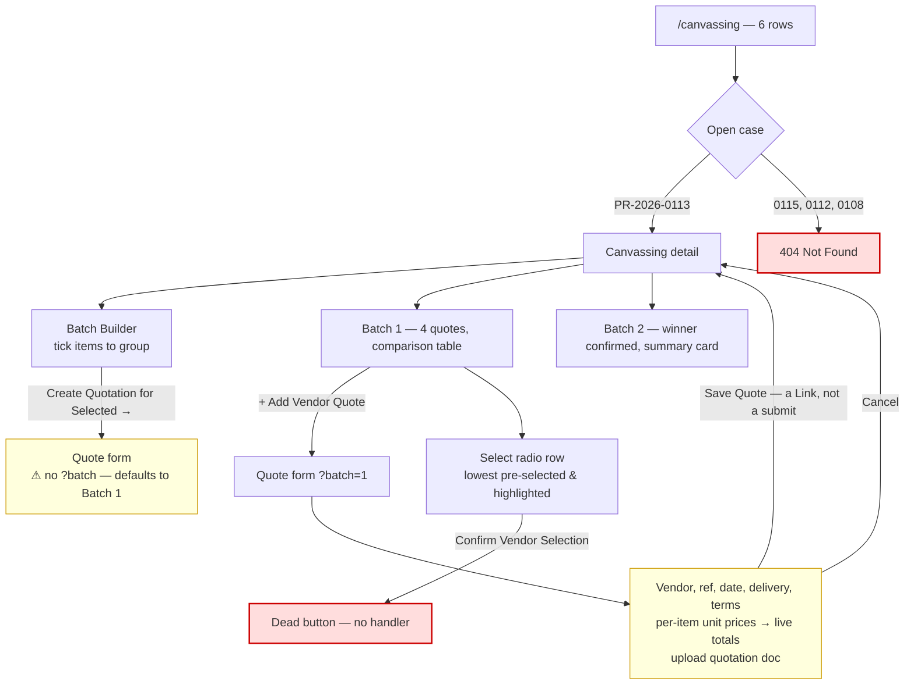

---

## Flow 5 — Record proof of order and close out delivery

| Aspect | Detail |
|---|---|
| **Goal** | Evidence that an ordered item actually arrived, and drive the PR to Completed. |
| **Entry point** | PR detail for any PR with a `po-created` item; "+ Add Proof of Order" secondary link in the PR table; "Add Proof of Order & Confirm Delivery" on a PR card. |
| **Screens** | `/purchase-requests/[id]` (the form is inline, not a separate route) |
| **User actions** | Upload vendor confirmation / invoice / signed PO, set confirmed delivery date, optionally enter a vendor reference, Save. |
| **System responses** | The form renders **only for the first item** whose status is `po-created` (`request.items.find(...)`). Delivered rows get a green tint and read "Proof on file". |
| **Decision points** | None modelled — no partial delivery, no rejection-on-receipt, no quantity-received field. |
| **Success outcome** | Intended: item → Delivered; when all items are delivered, PR → Completed. |
| **Failure scenarios** | None handled. |
| **Exit points** | Elsewhere on the PR detail page. |

### Defects in this flow

1. **The per-row button is dead.** Every `po-created` row in `PurchaseRequestItemsTable` renders an "Add Proof of Order & Confirm Delivery" button with no `onClick` and no link. The only functioning path is the inline form far below, which the user has to scroll to and which is not visually connected to any row.
2. **Multi-item PRs cannot be closed.** `PR-2026-0114` has two `po-created` items but the form appears once, for the first only. There is no way to reach the second.
3. **No quantity reconciliation.** The model has no `quantityReceived`. Partial delivery of a single line cannot be expressed, even though "Partially Completed" is a first-class PR status.

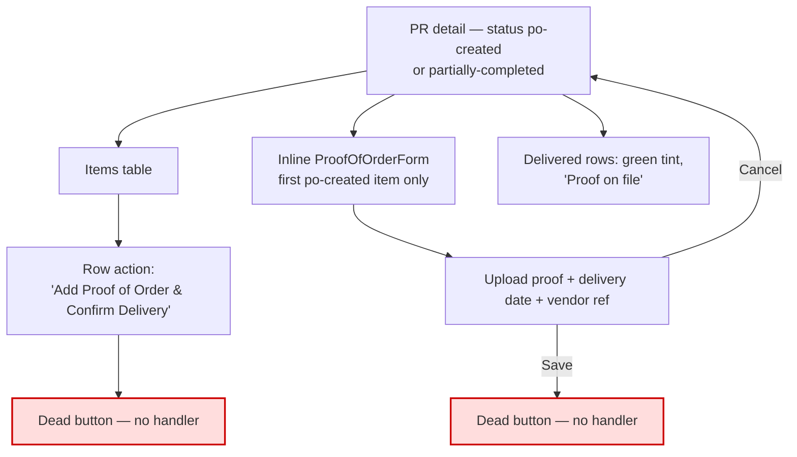

---

## Flow 6 — Generate a report

| Aspect | Detail |
|---|---|
| **Goal** | Read procurement performance for a period. |
| **Entry point** | Sidebar → Reports; global search Vendor results. |
| **Screens** | `/reports` |
| **User actions** | Optionally set Date Range / Department / Vendor filters; click Generate on one of five report cards; read the chart and table; Export. |
| **System responses** | **This flow has the best implemented feedback in the app.** Clicking Generate disables all five buttons, shows a spinner in the clicked card, and swaps the result panel for an `aria-live="polite"` loading card with a placeholder chart area and three skeleton bars, for 900 ms. The result then renders with a bar chart and supporting table. |
| **Decision points** | Which of five reports: PR Cycle Time, Spend by Department, Vendor Performance, Purchaser Performance, Canvassing Compliance. |
| **Success outcome** | Chart + table render; the card gains an "Active" badge and a primary ring; its button becomes "Regenerate". |
| **Failure scenarios** | None. |
| **Exit points** | Sidebar. |

**Visual only:** the three filter dropdowns are not wired to anything, and Export has no handler. Every report's data is a fixed constant regardless of filters.

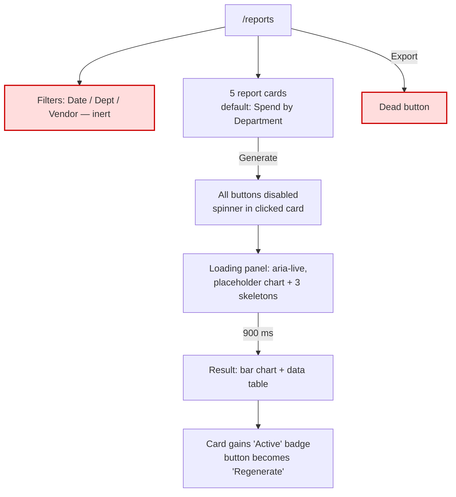

---

## Flow 7 — Request a new catalog item

| Aspect | Detail |
|---|---|
| **Goal** | Get a SKU created that isn't yet in the catalog, so it can be sourced. |
| **Entry point** | "Item Creation Requests →" ghost button on the PR list header; "Request New Item →" inline link on a non-catalog line in the new-PR editor. |
| **Screens** | `/purchase-requests/item-requests` |
| **User actions** | Read the 3-row table; filter by status; click "New Item Creation Request". |
| **System responses** | Static table. Status pills: Pending (warning), Approved (success), Rejected (danger, with reason inline in the label). |
| **Decision points** | None available. |
| **Success outcome** | Not achievable — there is no creation form. |
| **Failure scenarios** | n/a |
| **Exit points** | Linked PR detail via the "Requested For" column. |

**Defects:** "New Item Creation Request" is a dead button with no destination. The "Open →" cell is plain text, not a link — the row cannot be opened. Reaching this page from the PR editor discards the in-progress PR entirely.

---

# Screen-by-Screen Analysis

---

## S1 · Login — `/login`

**Purpose.** Entry gate to the application. Establishes organisational identity.

**Available actions**

| Action | Type | Status |
|---|---|---|
| Sign In | Submit | Navigates to `/dashboard` unconditionally |
| Forgot password? | Link | → `/login` (self) |
| Keep me signed in | Checkbox, default checked | No effect |

**Inputs.** `email` (type=email, required, autoComplete=email), `password` (type=password, required, autoComplete=current-password), `remember` (checkbox).

**Outputs.** Org name and identity block, copyright line, "Trouble signing in? Contact your Administrator."

**Navigation options.** Dashboard only.

**Validation.** Browser-native `required` and email-format only. No server validation, no strength rules, no rate limiting.

**Pain points & UX issues**

- No error state at all — no wrong-password message, no locked-account message, no network-failure message.
- No submit loading state; on a real backend the button will appear unresponsive.
- "Forgot password?" links to itself, which reads as broken to a user who clicks it.
- Credentials travel as **URL query parameters** because the form uses the default GET method. In production this would write passwords into browser history, server logs, and referrer headers. This is a security defect, not merely a UX one.
- Login is fully bypassable — every route is publicly reachable.

**Suggested improvements**

1. Convert to a POST server action with a real session; add `middleware.ts` to guard the `(dashboard)` group.
2. Add an `Alert variant="destructive"` slot above the fields for auth errors, associated with the form via `aria-describedby`.
3. Add pending state to the submit button (`useFormStatus`) — disabled, spinner, "Signing in…".
4. Give "Forgot password?" a real destination or remove it until one exists.
5. Preserve the entered email across a failed attempt.

---

## S2 · Dashboard — `/dashboard`

**Purpose.** Workload triage. Answers "what needs me today".

**Available actions**

| Action | Type | Status |
|---|---|---|
| New Purchase Request | Link button | Works |
| PR No. in action table | Link (6 rows) | Works |
| Pending quotation summary | Link (3 rows) | 1 of 3 works; 2 → 404 |
| KPI tiles | — | Not interactive |
| Activity entries | — | Not interactive |
| Deadline entries | — | Not interactive |

**Inputs.** None.

**Outputs.**

- 5 KPI tiles: Pending PRs (18), Requiring Your Action (6), Pending Quotations (9), Partially Completed PRs (5), Overdue Deliveries (4). Marked up correctly as a `<dl>` with `<dd>` value and `<dt>` label.
- Requests Requiring Action — 6 rows: PR No., Requester, Department, Amount, Step (status pill), Priority.
- Recent Activity — 3 entries with relative timestamps.
- Pending Quotations — 3 entries.
- Upcoming Deadlines — 3 entries; overdue rendered as a danger pill.

**Navigation options.** PR detail, canvassing detail, New PR, plus all global chrome.

**Validation.** n/a.

**Pain points & UX issues**

- **KPI tiles are dead ends.** "Requiring Your Action: 6" is the single most actionable number on the screen and clicking it does nothing. There is no filtered list view behind any tile.
- **KPI numbers contradict the data.** The tile says 18 pending PRs; `purchaseRequests` contains 10 and the list shows 6 of a claimed 18. Fine for a template, but it will confuse stakeholders in a demo.
- **Two of three Pending Quotations links 404.**
- **The action table has no per-row action.** Every other list in the app offers a next step ("Add Proof of Order", "Manage Canvassing"); the dashboard's most important table offers only a link to the record.
- No date/period context anywhere — "Overdue Deliveries: 4" gives no timeframe.
- Activity and deadlines have no "view all".
- No empty state for any of the four panels.
- Timestamps are pre-rendered strings ("10 minutes ago") that will be stale the moment real data arrives.

**Suggested improvements**

1. Make each KPI tile a link into a pre-filtered list (`/purchase-requests?status=…&assignee=me`). This is the highest-value, lowest-cost change on the dashboard.
2. Add a per-row next-action column to Requests Requiring Action, reusing the `nextAction()` helper already written in `pr-card.tsx`.
3. Point Pending Quotations at `/purchase-requests/[id]` until canvassing detail exists for more PRs, or generate detail pages for every canvassing case.
4. Add a period label to the header ("as of 27 Jul 2026") and a manual refresh affordance.
5. Add empty states for all four panels using the existing `Empty` component.
6. Give the KPI tiles trend context (delta vs. previous period) — the data model already supports the idea in the reports tone system.

---

## S3 · Purchase Requests list — `/purchase-requests`

**Purpose.** The primary work queue. Track every request from draft through delivery.

**Available actions**

| Action | Type | Status |
|---|---|---|
| Item Creation Requests → | Link | Works |
| Cards / Table view toggle | Link buttons, URL-backed | **Works** |
| New Purchase Request | Link | Works |
| Free-text filter | Input | **Inert** |
| Status / Priority / Department / Date filters | 4 selects | **Inert** |
| Open → / card title | Link | Works |
| + Add Proof of Order | Link (conditional) | Works |
| Manage Canvassing (card) | Link | 404 for all listed canvassing PRs |
| Pagination 1 / 2 / 3 | Links | **Inert** — `?page` is never read |

**Inputs.** `?view=table|cards` (the only functional input).

**Outputs.** Six requests, in a fixed order defined by `listedPurchaseRequestIds`. Status legend with 6 tones. Footer "Showing 6 of 18".

**Card view** (default): left accent stripe in the status colour, PR number, priority badge, title (or italic "Untitled — add a title while editing"), requester · department, amount, status pill, date, and a conditional full-width next-action button.

**Table view**: 9 columns — PR No., Title, Requester, Department, Amount, Priority, Status, Created, Actions.

**Navigation options.** PR detail, New PR, Item Creation Requests, canvassing detail.

**Validation.** n/a.

**Pain points & UX issues**

- **Filters and search do nothing.** Five controls occupy the top of the primary work queue and none of them filter. `FilterSelect` has no `value`/`onValueChange`; `DataToolbar`'s input has no handler. On a real 18+ row dataset this screen becomes unusable.
- **No column sorting.** Not by amount, date, priority, or status.
- **Pagination is decorative.** Fixed 1/2/3, page 1 always active, `?page` never read by the page component.
- **Draft rows lose their identity.** Both the card and table send drafts to `/purchase-requests/new` — a fixed mock form — instead of `/purchase-requests/[id]/edit`. The user's draft content is not loaded.
- **"Showing 6 of 18" is unexplained.** No indication of why 12 rows are missing.
- The free-text input has **no accessible label** — only a placeholder. Screen reader users hear an unlabelled search box.
- The table's Actions column stacks two links vertically with no visual separation from the row above.
- No bulk selection or bulk actions, despite the batching concept being central elsewhere in the product.
- No empty state — if the list were empty the page would render a bare status legend and nothing else.

**Suggested improvements**

1. **Wire the filters to URL search params.** The page already reads `searchParams` for `view`; extend the same pattern to `status`, `priority`, `department`, `q`, and `page`. This preserves the current design exactly and makes filter state shareable and back-button-safe.
2. Add sortable column headers in table view (`?sort=amount&dir=desc`), with `aria-sort` on the `<th>`.
3. Show an active-filter summary row with removable chips and a "Clear all", so users can see why the count dropped.
4. Route drafts to a real edit route that loads the record.
5. Add `aria-label="Filter requests"` to the toolbar input.
6. Add an `Empty` state for both zero-results and zero-records, distinguishing the two.
7. Add a saved-views concept ("My drafts", "Awaiting my action", "Overdue") as toolbar presets.
8. Add row selection with a bulk action bar (bulk export, bulk cancel).

---

## S4 · New Purchase Request — `/purchase-requests/new`

**Purpose.** Compose and submit a purchase request.

**Available actions**

| Action | Type | Status |
|---|---|---|
| Cancel | Link | Works → PR list |
| Save as Draft | Button | **Dead** — no handler |
| Submit for Approval | Link | Navigates to fixed `PR-2026-0117` |
| Item select (per row) | Select | **Works** — auto-fills, derives sourcing |
| Quantity (per row) | Number input | **Works** — recomputes totals |
| Est. unit cost (per row) | Number input | **Works** — recomputes totals |
| Vendor (Direct rows only) | Select | **Works** |
| Add Item | Button | **Works** |
| Remove row | Icon button | **Works** |
| Request New Item → | Link | Works, but discards the form |
| Department / Priority | Selects | **Inert** (`FilterSelect`, no state) |
| Attachments | File input | Accepts files, no list/preview/removal |

**Inputs.** Title (optional, free text), Requester (readonly, prefilled "S. Galvis (you)"), Department (select), Date Needed (date), Priority (select), Justification (textarea, 4 rows), line items (3 seeded), attachments (multiple).

**Outputs.** Live per-line totals, live grand total ("Total Estimated Amount"), sourcing legend, "Before you submit" 4-point checklist, "Approval Routing (preview)" showing "Department Manager → Procurement Review".

**Navigation options.** PR list, PR detail, Item Creation Requests.

**Validation.** **None.** Not a single field is `required`. Submit navigates regardless of state — an entirely empty form submits successfully. The checklist claims "Every item needs a quantity and unit before submitting" and this is not enforced anywhere.

**Pain points & UX issues**

- **The "Canvass?" toggle described in the checklist does not exist** (detailed in Flow 3). This is the most serious content/implementation mismatch in the build.
- **Contradictory copy.** The checklist says the user controls sourcing; the legend eight lines above says it is "determined automatically, not editable here".
- **No validation of any kind**, despite a panel explaining the validation rules.
- **Save as Draft is dead**, so the draft state visible elsewhere in the app is unreachable from here.
- **Navigating to Item Creation Requests destroys the form.** A user who discovers mid-entry that an item isn't in the catalog must choose between their draft and requesting the item. This is the sharpest workflow trap in the app.
- **Removing a line has no confirmation and no undo.**
- **Department and Priority use `FilterSelect`**, a component built for toolbars. It carries no `name`, holds no value, and cannot participate in form submission. Priority's placeholder reads "Normal", which looks like a selected default but is actually the null option.
- **Approval routing is static text**, though it claims to be "based on the request amount and department" — neither of which is read.
- **Attachments give no feedback.** After choosing files, nothing changes on screen. No filenames, no sizes, no remove, no type/size limits stated.
- The right rail (checklist + routing) is below the fold on mobile, after the entire item table.
- No unsaved-changes guard on Cancel or on browser navigation.
- No auto-save, despite "Save as Draft" implying draft-first workflow.

**Suggested improvements**

1. **Resolve the sourcing contradiction first** — either build the per-row Canvass? toggle the checklist promises, or rewrite the checklist to match the automatic derivation. Do not ship both messages.
2. Add field-level validation with inline errors using the existing `Field`/`FieldError` primitives; block submit and move focus to the first invalid field.
3. Replace `FilterSelect` in this form with a proper form-bound `Select` carrying `name` and `value`.
4. Implement Save as Draft, and add debounced auto-save with a "Saved · 2 min ago" indicator in the header.
5. Make "Request New Item" open a **dialog** rather than navigating away. The `Sheet` and `Popover` primitives are already in the project; nothing new is needed.
6. Add an unsaved-changes guard on Cancel.
7. Render a file list under the drop zone with name, size, and a remove button; state accepted formats and the size cap.
8. Add undo on line removal (toast with "Undo") or a confirm for rows with data.
9. On mobile, move the checklist above the items table, or collapse it into an expandable summary.
10. Add a running item count and a "0 items" empty state to the editor.

---

## S5 · Purchase Request detail — `/purchase-requests/[id]`

**Purpose.** The record of truth for one request: status, items, documents, discussion, history, next action.

**Available actions**

| Action | Type | Status |
|---|---|---|
| Continue Editing (drafts) | Link | → `/purchase-requests/new` (mock) |
| Revise & Resubmit (rejected) | Link | → `/purchase-requests/new` (mock) |
| Download PDF | Button | **Dead** |
| Cancel Request | Button | **Dead** — and no confirmation |
| Add Proof of Order & Confirm Delivery (per row) | Button | **Dead** |
| View Canvassing → (per row) | Link | 404 unless PR-2026-0113 |
| View Canvassing — Batch N (action panel) | Link | 404 unless PR-2026-0113 |
| Add a comment | Textarea | No submit control at all |
| Proof of order form | Form | Fields work; Save is dead |

**Inputs.** Route param `id`. Comment textarea. Proof-of-order fields (file, date, vendor ref).

**Outputs.** Adaptive by status:

| Status | Header actions | Stepper | Alert | Proof form | Comments |
|---|---|---|---|---|---|
| `draft` | Continue Editing | Replaced by "No approval workflow has started" card | — | — | Hidden |
| `canvassing` | Download PDF, Cancel Request | Step 2 current | — | — | Shown |
| `po-created` | Download PDF, Cancel Request | Step 2 current | — | **Shown** | Shown |
| `partially-completed` | Download PDF, Cancel Request | Step 2 current | — | **Shown** | Shown |
| `completed` | Download PDF only | Step 3 done | — | — | Shown |
| `rejected` | Revise & Resubmit | **Step 1 current** ⚠ | Destructive alert with reason | — | Shown |

Also: composed meta line (requester · department · submitted/completed/rejected date · total · item count), status pill, priority badge, title or italic "Untitled" with "(auto-generated title)" annotation, items table with per-item vendor/status/action, "N of M delivered" counter, documents list, comments, activity history.

**Navigation options.** Canvassing detail, New PR, plus global chrome.

**Validation.** None.

**Pain points & UX issues**

- **The stepper misrepresents rejected requests.** `currentStep()` returns 0 for `rejected`, so a rejected PR shows "Submitted" as the *current* step with a live progress track — as though it were still moving forward. The destructive alert above it says the opposite. Rejected needs its own terminal treatment.
- **The three-step stepper is too coarse.** "Sourcing & Fulfillment" covers canvassing, vendor selection, PO creation, and delivery — four distinct states that the data model already distinguishes and that the status pill already names more precisely. The stepper adds visual weight without adding information.
- **Every per-row action is dead or broken** (proof-of-order button; View Canvassing link).
- **Proof of order only reachable for the first `po-created` item.** `PR-2026-0114` has two and can never be completed.
- **The comment box has no Post button.** A textarea sits there with no way to submit.
- **Cancel Request has no confirmation** — a destructive action with no guard. It is inert today, which is the only reason this is not already a data-loss bug.
- **Download PDF is dead** and gives no indication that it is unavailable.
- **"Continue Editing" and "Revise & Resubmit" both go to the same blank mock form**, losing the record entirely.
- The `documents` array has no upload affordance on this screen — documents can be read but never added.
- The items table has no sourcing column, so a reader cannot tell why one item went to canvassing and another didn't.
- Activity history is capped at whatever is seeded, with no "view all" and no filtering.
- No print stylesheet, despite Download PDF implying a document-oriented use case.

**Suggested improvements**

1. Give `rejected` a distinct stepper state — a terminated track with a danger-toned marker — or hide the stepper entirely and lead with the alert.
2. Expand the stepper to mirror the actual statuses: Submitted → Canvassing → PO Created → Delivered → Completed, with the current step derived from item states.
3. Make the per-row proof button open a dialog scoped to *that* item; drop the single inline form.
4. Add a Post button and author attribution to the comment box; support `@` mentions later.
5. Add a confirmation dialog to Cancel Request, requiring a reason (which then populates the activity history).
6. Add an upload control to the Documents card.
7. Add a Sourcing column to the items table, reusing the `StatusDot` legend from the editor.
8. Route Continue Editing / Revise to an ID-bearing edit route.
9. Add a print stylesheet and wire Download PDF to it as an interim step.

---

## S6 · Item Creation Requests — `/purchase-requests/item-requests`

**Purpose.** Track requests to add SKUs to the master catalog.

**Available actions**

| Action | Type | Status |
|---|---|---|
| New Item Creation Request | Button | **Dead** |
| Status filter | Select | **Inert** |
| Free-text filter | Input | **Inert** |
| Requested For → PR | Link | Works |
| Open → | Plain text | **Not a link** |

**Inputs.** None functional.

**Outputs.** A leading informational `Alert` explaining why this page isn't a sidebar tab. Table of 3 requests: Item Name, Requested For (PR link or "Standalone (no PR yet)"), Requested By, Status, Submitted.

**Navigation options.** PR detail via "Requested For".

**Validation.** n/a.

**Pain points & UX issues**

- **The page's primary purpose cannot be fulfilled** — there is no creation form behind the only primary button.
- **Rows cannot be opened.** "Open →" is a `<TableCell>` containing text.
- **The explanatory alert is developer-facing.** "Reached from a link inside Purchase Requests (not a sidebar tab)" describes an IA decision to an end user who has no use for it.
- Rejection reasons are crammed into the status pill: "Rejected — duplicate of existing SKU". This breaks the visual rhythm of every other status pill in the app and will not scale to a real reason.
- No detail view, so there's nowhere to see the requested item's specification, unit, category, or approver notes.
- No indication of who approves these, or how long it typically takes.
- No link back to the PR editor for a user who arrived mid-composition.

**Suggested improvements**

1. Build the creation dialog: item name, category, unit, estimated cost, justification, optional linked PR.
2. Make "Open →" a real link to a detail view or dialog.
3. Replace the developer note with user-facing guidance, or delete it.
4. Move rejection reasons out of the pill into a secondary line or a tooltip, matching how the PR detail page handles rejection.
5. Add SLA context — "typically reviewed within 2 business days".
6. When arriving from the PR editor, carry a return link and prefill the item name.

---

## S7 · Canvassing list — `/canvassing`

**Purpose.** All items currently out for vendor quotation, grouped into batches.

**Available actions**

| Action | Type | Status |
|---|---|---|
| Status / Department filters | 2 selects | **Inert** |
| Free-text filter | Input | **Inert** |
| PR Reference | Link | Works |
| Open → | Link | **404 for 5 of 6 rows** |

**Inputs.** None functional.

**Outputs.** 8-column table: PR Reference, Item, Batch, Department, Quotes Received (`n / m minimum` or `n / m (exempted)`), Status, Initiated, Actions. Rows from `PR-2026-0113` Batch 1 share a `bg-muted/40` tint. A footnote explains the multi-batch grouping. An `Empty` state is defined for zero cases but is unreachable with current data.

**Navigation options.** PR detail, canvassing detail.

**Validation.** n/a.

**Pain points & UX issues**

- **Five of six "Open →" links 404.** This is the most visible break in the application.
- **The row-grouping tint is hard-coded** to a specific PR and batch (`entry.purchaseRequestId === "PR-2026-0113" && entry.batch === 1`). It will not generalise to real data.
- **The grouping is explained in a footnote below the table**, which most users will never read. The relationship should be visible in the table itself.
- **The quote-count column is text, not a progress indicator.** "2 / 3 minimum" is the key urgency signal on this screen and it carries no visual weight. A `Progress` component already exists in the project.
- **No sorting or aging column.** "Initiated Jul 12" with no elapsed-days column means overdue canvassing is invisible.
- **No quote deadline**, despite the dashboard showing "Quote deadline — PR-2026-0113".
- The Actions column offers only "Open →" — no "Add Quote" shortcut, even though that is the dominant action on this screen.
- The `UsersIcon` used for Canvassing in the sidebar reads as "Users/Team", not "vendor sourcing".

**Suggested improvements**

1. **Generate canvassing detail pages for every case** (or redirect unmatched IDs to the parent PR with an explanatory banner). This is the single highest-priority fix in the build.
2. Replace the hard-coded tint with a generic rule: tint alternating PR groups.
3. Render quote progress as a `Progress` bar plus count, with a danger tone when below minimum and past the initiated date + N days.
4. Add an "Age" column (days since initiated) and make it sortable by default descending.
5. Add an inline "+ Add Quote" action to each row.
6. Wire the two filters, plus add a "Below minimum" quick filter.
7. Consider a different sidebar icon (`FileSearch`, `Scale`, or `Handshake`).

---

## S8 · Canvassing detail — `/canvassing/[id]`

**Purpose.** Group a PR's items into batches, collect quotes per batch, and award each batch to a vendor.

**Available actions**

| Action | Type | Status |
|---|---|---|
| Item checkboxes | Checkbox | **Works** — selection state and count |
| Create Quotation for Selected Items → | Link button | Works, but **drops the selection** (no `?batch`) |
| + Add Vendor Quote (per batch) | Link button | **Works** — passes `?batch=N` |
| Quote radio selection | Radio group | **Works** — lowest pre-selected |
| Confirm Vendor Selection | Button | **Dead** |

**Inputs.** Route param `id`; batch-builder checkbox state.

**Outputs.**

- Header: `Canvassing — PR-2026-0113`, with `department · N items · not all items need to go to the same vendor`.
- **Batch Builder** — all four PR items with quantity, batch badge (or "Not assigned"), and status pill. Selected rows tint info-blue. Footer shows the live count.
- **Per-batch sections.** Unresolved batches render a comparison table: vendor, total price ("(All Items)" appended when multi-item), delivery estimate, quote date, status. The lowest total is bolded in success green. Resolved batches collapse to a 4-metric summary: Winning Price, Delivery Estimate, Quotes Received, Selected On.

**Navigation options.** Quote form; nothing back to the PR (see below).

**Validation.** The Create Quotation button disables at zero selection. That is the only validation on the screen.

**Pain points & UX issues**

- **Only one PR has a detail page.** Every other canvassing case 404s.
- **The batch selection is thrown away.** The primary button ignores `selected` entirely.
- **The builder's own footer admits it**: "3 items selected — not yet grouped into an active batch". Users are told their action didn't finish, with no way to finish it.
- **Confirm Vendor Selection is dead**, so the flow's terminal action cannot be completed.
- **No link back to the parent PR.** Users arrive from a PR and have to use breadcrumbs or the sidebar to return. The header shows the PR ID as plain text, not a link.
- **Quote comparison is price-first.** Delivery estimate is a free-text string ("4 business days" vs "2 business days") that cannot be sorted or compared. The lowest-price highlight implies price is the deciding factor, but the delivery gap between the cheapest (4 days) and second-cheapest (2 days) may matter more.
- **No vendor context in the comparison.** The Vendor Performance report tracks ratings and on-time percentages; none of that surfaces where the decision is actually made.
- **No justification capture.** Choosing a non-lowest vendor requires no explanation, despite Canvassing Compliance being a tracked report metric.
- **Quotes cannot be edited, deleted, or viewed.** The uploaded quotation document is not linked from the comparison row.
- **The Status column is always "Received"** for every row — it carries no information.
- **No batch management.** Batches cannot be renamed, merged, split, or dissolved.
- The exemption path (`PR-2026-0112`) has no UI at all.

**Suggested improvements**

1. Pass the selection through: `?batch=new&items=id1,id2`, and create the batch on save.
2. Implement Confirm Vendor Selection with a confirmation dialog summarising vendor, total, delivery, and the delta vs. the lowest quote.
3. **Require a justification when the selected vendor is not the lowest** — this directly feeds the Canvassing Compliance report and is a standard procurement control.
4. Make the PR ID in the header a link back to the PR.
5. Add a vendor rating column (or hover card) to the comparison table, sourced from the same data as the Vendor Performance report.
6. Normalise delivery estimate to a number of days so it can be sorted and compared; keep the free-text as a note.
7. Add per-row quote actions: view document, edit, remove.
8. Add a "Request exemption" action for sole-source items, with an approval state.
9. Replace the static "Received" status with something meaningful (Received / Expired / Superseded).

---

## S9 · Add Vendor Quote — `/canvassing/[id]/quotes/new`

**Purpose.** Record one vendor's quote for every item in a batch.

**Available actions**

| Action | Type | Status |
|---|---|---|
| Cancel | Link | Works |
| Save Quote | **Link**, not submit | Navigates without saving |
| Vendor / Payment Terms | `FilterSelect` | **Inert** |
| Unit price per item | Number input | **Works** — live line and grand totals |
| Upload quotation | File input | Accepts, no feedback |

**Inputs.** Route params `id` and `?batch` (defaults to 1). Vendor, quote reference, quote date, delivery estimate, payment terms, per-item unit prices, quotation document.

**Outputs.** Live line totals, live "Total Quote Amount", and a right rail showing "Quotes received: n of m minimum" and "Lowest so far: {vendor} — {amount}". A second rail card explains that saving adds a comparison row and does not select a winner — genuinely useful expectation-setting.

**Navigation options.** Canvassing detail.

**Validation.** **None.** Vendor, date, and reference can all be blank; unit prices default to 0 and a zero-total quote saves happily.

**Pain points & UX issues**

- **Save is a navigation, not a submission.** Nothing persists.
- **No required-field enforcement** on vendor or quote date — the two fields without which a quote is meaningless.
- **Vendor uses `FilterSelect`** with the placeholder "Search or select a vendor…" — but it is a plain select with no search. The copy promises a capability the control does not have.
- **No way to add a vendor not already in the list.** The `vendors` array is fixed at six.
- **Unit prices default to `0`** rather than empty, so the form always shows "₱0.00" totals and a user cannot distinguish "not yet entered" from "genuinely free".
- **No duplicate detection** — the same vendor can be quoted twice for one batch.
- **No currency indicator on the input**; the field is a bare number while every output is peso-formatted.
- No quote-validity/expiry date field, though quotes routinely expire.
- Upload gives no filename confirmation.

**Suggested improvements**

1. Convert to a server action with required-field validation and inline errors; keep the current layout.
2. Replace the vendor `FilterSelect` with a real combobox supporting search and "+ Add new vendor".
3. Initialise unit prices as empty, showing "—" until entered.
4. Warn (don't block) when the vendor already has a quote in this batch.
5. Add a currency prefix addon to price inputs (`InputGroup` already supports this).
6. Add a "Quote valid until" date field.
7. Show the uploaded filename with a remove control.
8. Add "Save and add another vendor" as a secondary action — the common case is entering three quotes in one sitting.

---

## S10 · Reports — `/reports`

**Purpose.** Procurement performance analytics.

**Available actions**

| Action | Type | Status |
|---|---|---|
| Export | Button | **Dead** |
| Date Range / Department / Vendor | 3 selects | **Inert** |
| Generate / Regenerate (×5) | Buttons | **Works** — full loading cycle |

**Inputs.** Report selection only.

**Outputs.** Five report cards (icon, title, description, action button). One result panel with a bar chart and a supporting table. Reports available:

| Report | Chart | Table columns |
|---|---|---|
| PR Cycle Time | Avg. days by stage | Stage, Avg. Days, Slowest Dept, Trend |
| Spend by Department *(default)* | Total spend by dept | Department, POs Issued, Total Spend, Avg. Cycle Time |
| Vendor Performance | Avg. rating by vendor | Vendor, Avg. Rating, On-Time %, POs Fulfilled |
| Purchaser Performance | PRs processed by officer | Purchaser, PRs Processed, Avg. Cycle, Compliance |
| Canvassing Compliance | PR counts, semantically coloured | Department, PRs Canvassed, Met Minimum, Exempted |

**Navigation options.** Sidebar only.

**Validation.** n/a.

**Pain points & UX issues**

- **Filters don't filter**, yet every result title reads "— Last 90 Days", implying they do.
- **Export is dead** with no format choice.
- **Only one report at a time.** Comparing cycle time against compliance requires re-generating and losing the first.
- **No drill-down.** Clicking a bar or a table row does nothing; "Production: 42 POs" cannot be expanded into those 42 POs.
- **No date-of-generation stamp** on the result.
- **Trend deltas lack context** — "↑ 0.6" doesn't say against what baseline, and up-is-bad for cycle time while up-is-good elsewhere. The tone colour carries the whole meaning.
- **Charts are colour-monochrome by design** except Canvassing Compliance, which is the right call — but the compliance chart then relies on colour alone to distinguish Met/Exempted/Below, with category labels on the axis as the only fallback.
- **Purchaser Performance names individuals** with compliance percentages. This is a sensitive-data surface that should almost certainly be role-gated.
- **The 900 ms delay is a mock** and will not reflect real query time; the loading design should be validated against realistic latency.

**Suggested improvements**

1. Wire the three filters into the report data path and reflect them in the result title.
2. Implement Export with a format menu (CSV, XLSX, PDF) and a progress indicator.
3. Make bars and table rows drill through to a filtered PR list.
4. Add a generation timestamp and the active filter set to the result header.
5. Add explicit baseline labels to trend columns ("vs. prior 90 days") and a directional legend.
6. Add a saved/scheduled report concept — the natural next step for a reporting surface.
7. Gate Purchaser Performance behind a role check once RBAC exists.
8. Allow pinning two results side by side on wide screens.

---

## S11 · Settings shell — `/settings` → `/settings/account`

**Purpose.** Container for personal and administrative settings.

**Structure.** `/settings` redirects to `/settings/account`. The layout renders a shared `PageHeader` ("Settings — Manage your profile and, for administrators, everyone's access") and a two-item `SettingsNav` in a 4-column grid (stacked below `lg`).

**Pain points & UX issues**

- **Settings is not in the sidebar.** It is reachable only through the user dropdown — two clicks, and only if the user thinks to look there. The org-level Users & Roles panel is buried behind a personal-account menu.
- **The admin-only item renders for everyone.** `settingsNav` declares `adminOnly: true` for Users & Roles, but `SettingsNav` never reads that flag — it only appends "(Admin)" to the label. The current user is a Procurement Officer and sees the panel.
- The nav is a flat two-item list with no room to grow; a real settings section will need grouping.

**Suggested improvements**

1. Add Settings back to the sidebar as a footer-anchored item (below the nav, above the user), so it's discoverable without conflating it with the account menu.
2. Honour `adminOnly` once a role is available on the session; until then, keep the "(Admin)" label as an honest signal.
3. Group the nav into sections (Personal / Organisation / Procurement) ahead of adding items.

---

## S12 · My Account — `/settings/account`

**Purpose.** The signed-in user's own profile.

**Available actions**

| Action | Type | Status |
|---|---|---|
| Change Photo | Button | **Dead** |
| Save Changes | Button | **Dead** |
| Cancel | Button | **Dead** |

**Inputs.** Full Name (editable), Role (readonly), Company Email (editable), Department (readonly), Current Password, New Password, Confirm New Password.

**Outputs.** Avatar with hard-coded "JS" fallback initials, and a clear framing line: "Your own profile. Every role sees this panel — it's personal, not administrative."

**Validation.** None. New/Confirm are not compared. No strength requirements. No `required`.

**Pain points & UX issues**

- **Nothing saves.**
- **The avatar fallback is hard-coded `JS`** while `currentUser.name` is "S. Galvis" — an `initials()` helper already exists in `nav-user.tsx` and should be reused. As written, the avatar shows the wrong initials for every user.
- **Password change is mixed into the profile form** under one Save button, so a user editing their name is presented with three password fields. These are different operations with different risk profiles and should be separated.
- **No password confirmation check**, no strength meter, no visibility toggle.
- **No success or failure feedback** of any kind.
- Editing the company email — the login identifier — carries no verification step.
- No session/device list, no 2FA, no notification preferences, no language/timezone, no theme toggle (despite full dark-mode tokens existing in `globals.css`).

**Suggested improvements**

1. Split password change into its own card with its own Save.
2. Reuse `initials()` from `nav-user.tsx` for the avatar fallback.
3. Add confirm-match validation, a strength indicator, and a show/hide toggle.
4. Add success (`Alert`) and error feedback on save; disable Save until the form is dirty.
5. Add email-change verification.
6. **Add a theme toggle** — the dark palette is fully implemented in `globals.css` and currently unreachable. This is close to free.
7. Add notification preferences, which the notification system already implies.

---

## S13 · Users & Roles — `/settings/users`

**Purpose.** Administrative user management.

**Available actions**

| Action | Type | Status |
|---|---|---|
| Invite User | Button | **Dead** |
| Edit (per active user) | Link button | **Dead** |
| Resend (per invited user) | Link button | **Dead** |

**Inputs.** None.

**Outputs.** Leading alert ("Visible only to the Administrator role…"). Table of 4 users: Name (with "(you)"), Role, Department, Status (Active/Invited pill). The current user's action cell shows "—". Below, a Role Permissions definition list:

| Role | Stated permissions |
|---|---|
| Procurement Officer | Full access to PRs, canvassing, POs, evaluations, reports |
| Department Manager | Approve PRs for their department; view-only elsewhere |
| Administrator | Manage users, roles, and settings; no procurement actions |
| Employee / Requester | Create and track own PRs and Item Creation Requests |

**Validation.** n/a.

**Pain points & UX issues**

- **The alert is false.** It claims the panel is visible only to Administrators; it is visible to everyone, and the current seeded user is a Procurement Officer. This is a misleading security statement in the UI.
- **The Role Permissions table is documentation, not configuration.** Nothing in the application enforces a single line of it.
- **Every action is dead** — no invite, no edit, no deactivate, no role change.
- **No role filter, search, or sorting** — fine at 4 users, unusable at 40.
- **No audit trail** — no invited-by, no last-active, no created-date.
- **No deactivate/remove path**, and no explanation of what happens to a departed user's open PRs.
- **Roles are free-text strings** (`role: string`) rather than a union type, so nothing prevents typos or drift between this table and any future enforcement.

**Suggested improvements**

1. Change the alert to describe the *intended* rule honestly ("Once role-based access is enabled, only Administrators will see this panel") until enforcement exists.
2. Narrow `User["role"]` from `string` to a union type — a small change that makes future RBAC enforceable at compile time.
3. Build the Invite dialog (email, role, department) and the Edit dialog (role, department, status).
4. Add a deactivate action with a reassignment prompt for open records.
5. Add search + role filter + sorting.
6. Add last-active and invited-by columns.
7. Turn Role Permissions into a real matrix (roles × capabilities), read-only at first, editable later.

---

# User Journey Maps

Three personas are inferable from `rolePermissions` and the seed data. Only one of them — the Procurement Officer — has a workspace that actually matches their stated permissions.

---

## Journey A — Employee / Requester: "I need 200 hex bolts"

**Stated permissions:** Create and track own PRs and Item Creation Requests.

| Stage | Doing | Thinking | Feeling | Touchpoints | Friction |
|---|---|---|---|---|---|
| **1. Realise need** | Opens the app | "Where do I start a request?" | Neutral | Login, Dashboard | Dashboard shows *everyone's* work, not theirs. No "My Requests". |
| **2. Start request** | Clicks New Purchase Request | "Straightforward enough" | Confident | New PR form | — |
| **3. Fill details** | Title, department, date, priority, justification | "Do I have to pick a department? Nothing's marked required" | Mild uncertainty | New PR form | No required markers; Department/Priority selects don't hold a value |
| **4. Add items** | Selects from catalog, sets quantities | "Good — cost fills itself in" | Positive | Line items editor | Live totals work well |
| **5. Hit a missing item** | Item isn't in the catalog | "It says Request New Item — but I'll lose everything I typed" | **Frustrated** | Warning row → ICR page | **Navigation destroys the draft.** Worst moment in the journey. |
| **6. Sourcing question** | Reads the checklist | "It says I can toggle Canvass? off — where is that?" | **Confused** | Checklist vs. legend | **The toggle doesn't exist, and the legend says the opposite** |
| **7. Submit** | Clicks Submit for Approval | "Did that work? It just… moved" | Uncertain | PR detail | No confirmation, no toast, no "submitted" acknowledgement |
| **8. Track** | Checks back later | "Where do I see just mine?" | Neutral | PR list | No ownership filter; no notification on approval |
| **9. Handle rejection** | Sees rejection | "Clear reason, good" then "…this just opened a blank form" | Mixed | PR detail → New PR | Reason display is genuinely good; Revise loses the record |

**Highest-friction moments:** steps 5 and 6.

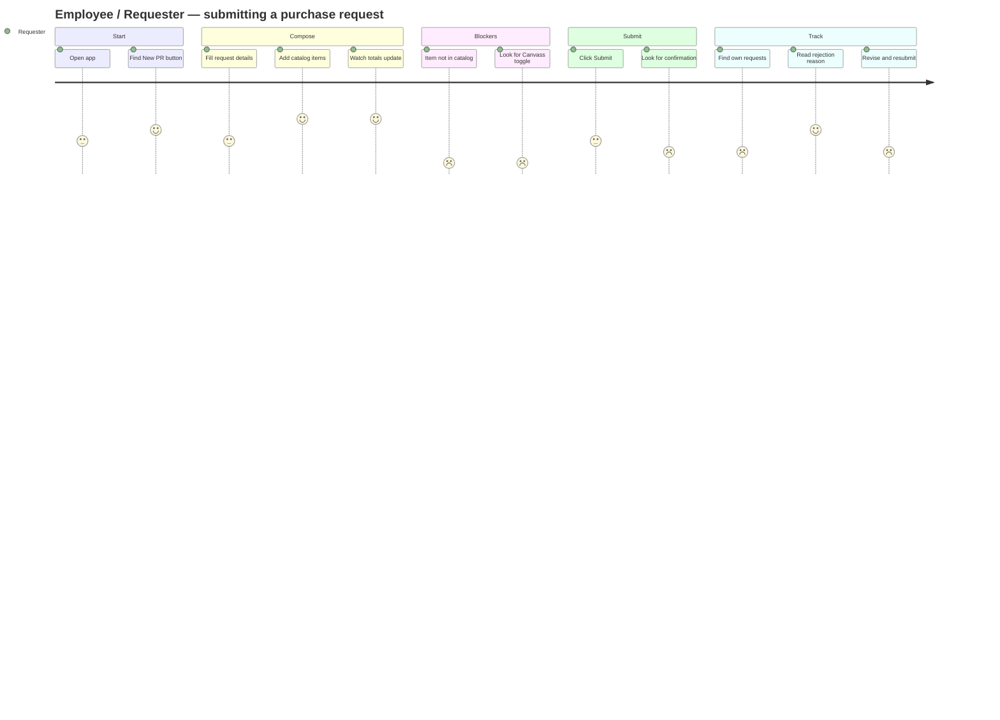

---

## Journey B — Procurement Officer: "Source PR-2026-0113"

**Stated permissions:** Full access to PRs, canvassing, POs, evaluations, reports.
This is the persona the application is genuinely built for — and even here, three of the four terminal actions are unavailable.

| Stage | Doing | Thinking | Feeling | Touchpoints | Friction |
|---|---|---|---|---|---|
| **1. Triage** | Scans dashboard | "Six need me — this is a good summary" | Positive | Dashboard | KPI tiles aren't clickable |
| **2. Pick work** | Opens a canvassing case | "Open →" | Confident | Canvassing list | **5 of 6 rows 404** |
| **3. Understand the PR** | Reads batch builder | "Batch 1 comparing, Batch 2 won, one unassigned — clear" | **Positive** | Canvassing detail | The batching model reads well |
| **4. Group items** | Ticks two items, clicks Create Quotation | "It says 'not yet grouped into an active batch' — did that work?" | **Confused** | Batch builder | **Selection is discarded** |
| **5. Enter quotes** | Fills the quote form | "Totals update, and it tells me the lowest so far — nice" | Positive | Quote form | Vendor select promises search it doesn't have |
| **6. Save quote** | Clicks Save Quote | "Back to the list… is it saved?" | Uncertain | → Canvassing detail | Nothing persisted, no confirmation |
| **7. Compare** | Reviews the table | "Cheapest is Del Rosario at 4 days; Acme is ₱1,350 more at 2 days" | Engaged | Comparison table | No vendor ratings here; delivery isn't comparable |
| **8. Award** | Clicks Confirm Vendor Selection | *nothing happens* | **Blocked** | Comparison table | **Dead button — the flow cannot complete** |
| **9. Close out** | Goes to a PR needing proof | Uploads proof, sets date, Save | **Blocked** | PR detail | **Dead button; and only the first item is reachable** |

**Highest-friction moments:** steps 2, 4, 8, 9 — three of which are terminal actions.

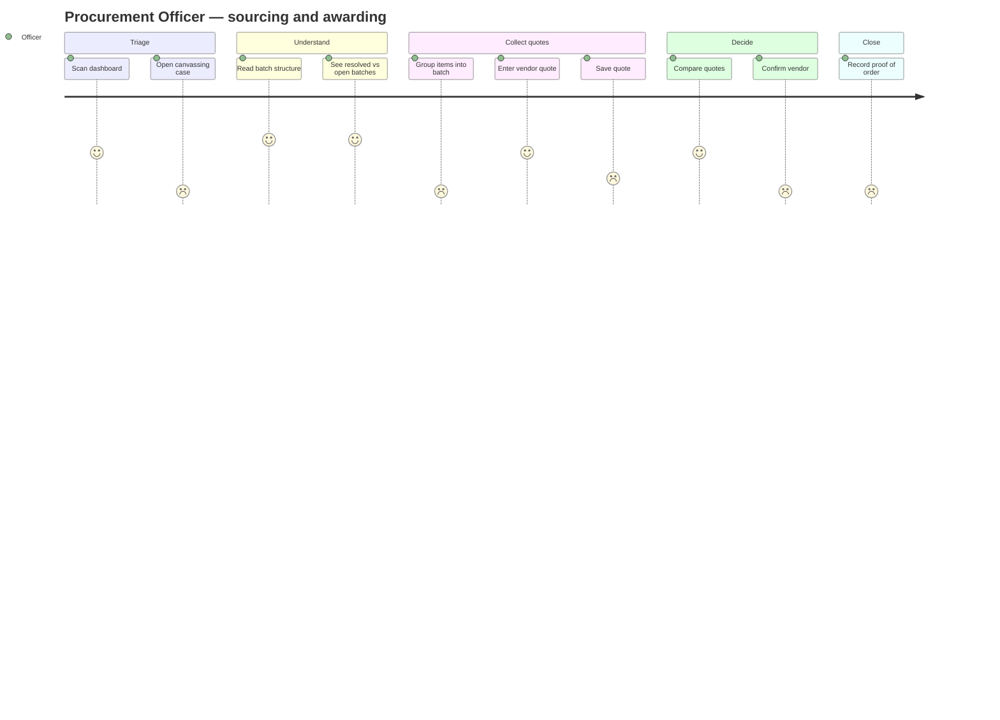

---

## Journey C — Department Manager: "Approve my team's requests"

**Stated permissions:** Approve PRs for their department; view-only elsewhere.

| Stage | Doing | Thinking | Feeling | Touchpoints | Friction |
|---|---|---|---|---|---|
| **1. Notified** | Opens a notification | "PR-2026-0114 needs your review" | Ready | Notifications | Works |
| **2. Open PR** | Reads the record | "Items, amounts, justification — I can see it" | Neutral | PR detail | Justification entered on the form isn't displayed on detail |
| **3. Approve** | Looks for Approve / Reject | **"There are no approval buttons anywhere"** | **Blocked** | PR detail | **The entire approval workflow is absent** |
| **4. Give feedback** | Types in the comment box | "There's no Post button" | **Blocked** | PR detail | Comment cannot be submitted |
| **5. See team scope** | Looks for their department's queue | "Everything is here; nothing is mine" | Frustrated | PR list | Department filter is inert |

**Verdict:** This persona has **no functional journey**. The approval workflow — referenced by the "Approval Routing (preview)" panel, the "Submit for Approval" button, the "Requests Requiring Action" dashboard table, the `rolePermissions` copy, and the seeded activity entry "PR-2026-0110 approved by Department Manager" — exists nowhere in the UI.

This is the single largest **workflow gap** in the system.

---

# Journey Tables

## Master workflow table

| # | Workflow | Entry | Screens | Terminal action | Terminal action works? | Persisted? |
|---|---|---|---|---|---|---|
| 1 | Sign in | `/login` | 1 | Sign In | Navigates only | No |
| 2 | Triage workload | Sidebar / `/` | 1 | Open record | Yes | n/a |
| 3 | Create PR | Dashboard / PR list | 2 | Submit for Approval | Navigates to fixed mock | No |
| 4 | Save draft | New PR form | 1 | Save as Draft | **No — dead** | No |
| 5 | Review PR | PR list / search / notification | 1 | — (read-only) | n/a | n/a |
| 6 | Cancel PR | PR detail | 1 | Cancel Request | **No — dead** | No |
| 7 | Export PR | PR detail | 1 | Download PDF | **No — dead** | No |
| 8 | Comment on PR | PR detail | 1 | (no submit control) | **No — absent** | No |
| 9 | **Approve / reject PR** | — | **0** | — | **Workflow absent** | — |
| 10 | Request catalog item | PR list / PR editor | 1 | New Item Creation Request | **No — dead** | No |
| 11 | Build canvassing batch | Canvassing detail | 1 | Create Quotation for Selected | Navigates, **drops selection** | No |
| 12 | Add vendor quote | Canvassing detail | 2 | Save Quote | Navigates only | No |
| 13 | Select winning vendor | Canvassing detail | 1 | Confirm Vendor Selection | **No — dead** | No |
| 14 | **Request quote exemption** | — | **0** | — | **Workflow absent** | — |
| 15 | **Create PO** | — | **0** | — | **Workflow absent** | — |
| 16 | Record proof of order | PR detail | 1 | Save | **No — dead** | No |
| 17 | Generate report | Sidebar | 1 | Generate | **Yes** — with loading state | In-session |
| 18 | Export report | Reports | 1 | Export | **No — dead** | No |
| 19 | Update profile | User menu | 1 | Save Changes | **No — dead** | No |
| 20 | Change password | Settings/Account | 1 | Save Changes | **No — dead** | No |
| 21 | Invite user | Settings/Users | 1 | Invite User | **No — dead** | No |
| 22 | Search records | Header | 1 | Open result | **Yes** | n/a |
| 23 | Read notifications | Header | 1 | Click item | **Yes** — marks read | In-session |
| 24 | Switch list view | PR list | 1 | Cards / Table | **Yes** — URL-backed | In URL |

**Score: 4 of 24 workflows complete** (triage, report generation, search, notifications) — plus view-switching. Three workflows have no UI at all.

## Screen action inventory

| Screen | Actions | Working | Visual only | Broken |
|---|---|---|---|---|
| Login | 3 | 1 | 2 | 0 |
| Dashboard | 4 | 3 | 1 | 0 |
| PR list | 10 | 4 | 5 | 1 |
| New PR | 12 | 7 | 4 | 1 |
| PR detail | 9 | 2 | 5 | 2 |
| Item Creation Requests | 5 | 1 | 3 | 1 |
| Canvassing list | 5 | 1 | 3 | 1 |
| Canvassing detail | 5 | 3 | 1 | 1 |
| Add Vendor Quote | 5 | 2 | 3 | 0 |
| Reports | 3 | 1 | 2 | 0 |
| My Account | 3 | 0 | 3 | 0 |
| Users & Roles | 3 | 0 | 3 | 0 |
| **Total** | **67** | **25** | **35** | **7** |

## State coverage by screen

| Screen | Empty | Loading | Error | Success/confirm | Partial/skeleton |
|---|---|---|---|---|---|
| Login | n/a | ✗ | ✗ | ✗ | ✗ |
| Dashboard | ✗ | ✗ | ✗ | n/a | ✗ |
| PR list | ✗ | ✗ | ✗ | n/a | ✗ |
| New PR | ✗ | ✗ | ✗ | ✗ | ✗ |
| PR detail | Partial¹ | ✗ | Partial² | ✗ | ✗ |
| Item Creation Requests | ✗ | ✗ | ✗ | ✗ | ✗ |
| Canvassing list | **✓**³ | ✗ | ✗ | n/a | ✗ |
| Canvassing detail | ✗ | ✗ | ✗ | ✗ | ✗ |
| Add Vendor Quote | ✗ | ✗ | ✗ | ✗ | ✗ |
| Reports | ✗ | **✓** | ✗ | **✓**⁴ | **✓** |
| My Account | n/a | ✗ | ✗ | ✗ | ✗ |
| Users & Roles | ✗ | ✗ | ✗ | ✗ | ✗ |

¹ "No comments yet." and a draft-specific "no approval workflow has started" card.
² Rejection alert — a business error, not a system error.
³ Defined but unreachable with current seed data.
⁴ "Active" badge on the generated report card.

**Reports is the only screen with a designed loading state, and it is the model the rest of the application should follow.**

---

# Mermaid Flow Diagrams

## D1 · Purchase request lifecycle (as modelled)

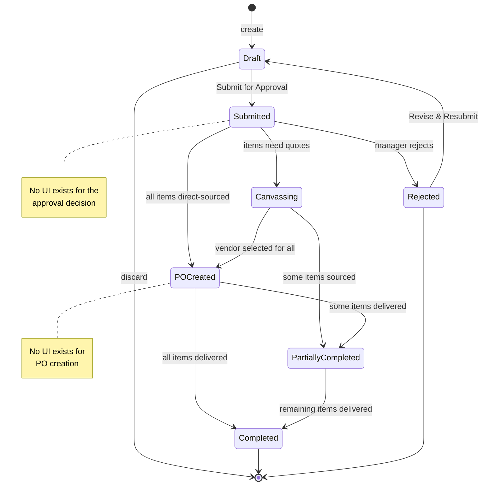

## D2 · Per-item sourcing (the system's core idea)

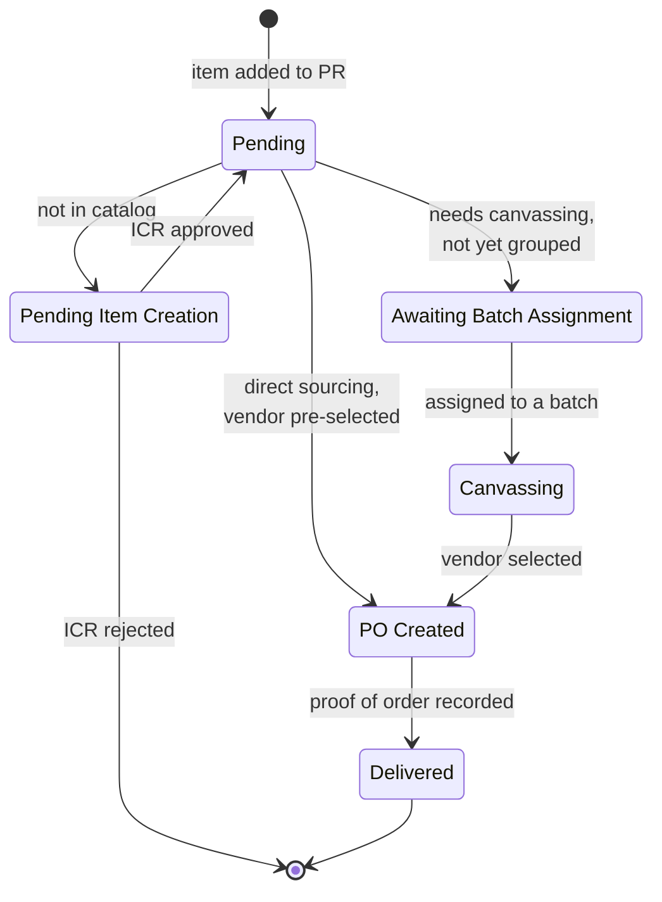

## D3 · End-to-end procurement flow with gaps marked

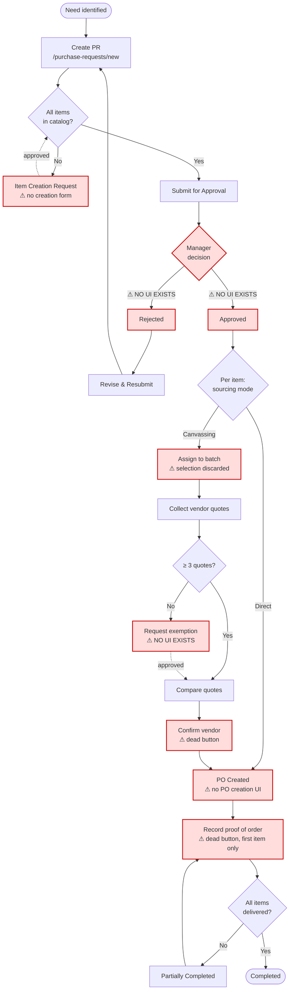

## D4 · Global search interaction

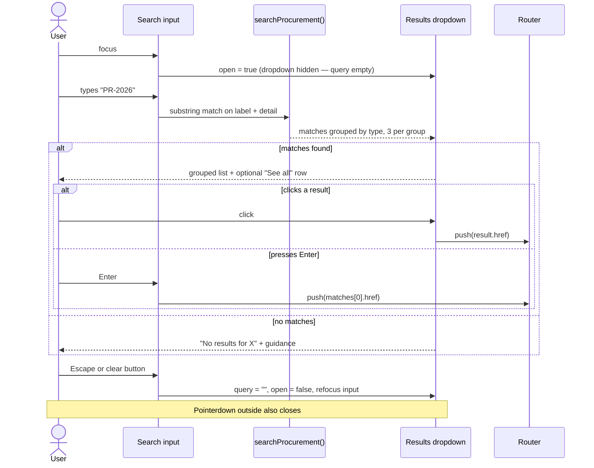

## D5 · Report generation

```mermaid
sequenceDiagram
    actor U as User
    participant C as Report card
    participant W as ReportWorkspace
    participant P as Result panel

    U->>C: click Generate
    C->>W: setGeneratingId(id)
    W->>C: disable all 5 buttons, show spinner
    W->>P: render loading card (aria-live=polite)
    P-->>U: placeholder chart + 3 skeleton bars
    Note over W: setTimeout 900 ms
    W->>W: setActiveId(id); setGeneratingId(null)
    W->>P: render ReportResult
    P-->>U: bar chart + data table
    W->>C: re-enable; active card gains ring + "Active" badge
```

## D6 · Responsive layout behaviour

```mermaid
flowchart LR
    subgraph Mobile["< 768px"]
        M1["Sidebar → Sheet overlay"]
        M2["PageHeader stacks vertically"]
        M3["Breadcrumbs: last crumb only"]
        M4["KPI grid: 2 columns"]
        M5["PR cards: 1 column"]
        M6["Tables scroll horizontally"]
        M7["Content padding p-4"]
    end
    subgraph Tablet["768 – 1024px"]
        T1["Sidebar: icon-collapsible"]
        T2["Full breadcrumb trail"]
        T3["KPI grid: 3 columns"]
        T4["PR cards: 2 columns"]
        T5["Content padding p-6"]
    end
    subgraph Desktop["≥ 1024px"]
        D1["Sidebar expanded"]
        D2["KPI grid: 5 columns (xl)"]
        D3["PR cards: 3 columns (xl)"]
        D4["Detail pages: 2/3 + 1/3 split"]
        D5["Settings: 1/4 + 3/4 split"]
    end
    Mobile --> Tablet --> Desktop
```

---

# UX Issues

Ranked by user impact. Severity: **S1** blocks a core task · **S2** causes confusion or rework · **S3** polish.

---

## S1 — Blocking

### 1.1 Five of six canvassing cases return 404
`generateStaticParams` in both `/canvassing/[id]` and `/canvassing/[id]/quotes/new` iterates `canvassingDetails`, which has exactly one entry. Every canvassing link for `PR-2026-0115`, `PR-2026-0112`, `PR-2026-0108`, and `PR-2026-0116` dead-ends — from the canvassing list, the dashboard, PR cards, PR item rows, and PR action panels.

**Fix:** Add `CanvassingDetail` entries for every PR that appears in `canvassingCases`. If that's not desirable as seed data, redirect unmatched IDs to the parent PR with an explanatory banner instead of `notFound()`.

### 1.2 No approval workflow exists
The most-referenced concept in the app has no screen. There is no Approve, no Reject, no reason capture, no approver queue, no delegation. `PR-2026-0109` carries a rejection reason that no UI could have produced.

**Fix:** Add Approve/Reject actions to the PR detail header, gated on status and (eventually) role, with a required reason on reject. Add a "Pending my approval" filter to the PR list.

### 1.3 Terminal actions across every workflow are dead buttons
Confirm Vendor Selection, proof-of-order Save, Save as Draft, Cancel Request, Download PDF, Export, Invite User, Save Changes, New Item Creation Request. Users reach the end of a flow, click, and nothing happens — the worst possible failure mode because it gives no signal at all.

**Fix:** Until handlers exist, either `disabled` them with a tooltip ("Available in a future release") or wire them to a toast that acknowledges the click. Silence is the problem.

### 1.4 Batch selection is discarded
`BatchBuilder` tracks selection and its own footer says "not yet grouped into an active batch", but the primary button navigates without `?batch`, defaulting to Batch 1.

**Fix:** Pass `?batch=new&items=…` and create the batch on quote save.

### 1.5 Multi-item PRs can never be completed
`ProofOfOrderForm` renders for `items.find(status === "po-created")` — the *first* match only. `PR-2026-0114` has two such items and no path to the second.

**Fix:** Move the form into a dialog triggered by each row's button.

### 1.6 No form validation anywhere
Not one field in the application is `required`. An empty PR submits. A quote with no vendor and no date saves. Passwords aren't compared.

**Fix:** Add server actions with schema validation and inline `FieldError` display; the `Field` primitives already support it.

---

## S2 — Confusing

### 2.1 The new-PR checklist describes a control that doesn't exist
The "Canvass?" toggle is documented in the checklist and contradicted by the legend eight lines away. Neither statement matches the code.

### 2.2 The Users & Roles alert makes a false security claim
"Visible only to the Administrator role" — it is visible to everyone, and the seeded user is not an administrator.

### 2.3 Rejected PRs show an active progress stepper
`currentStep("rejected")` returns 0, rendering "Submitted" as the current step with a live track, directly beneath a destructive alert saying the request was rejected.

### 2.4 Filters and search are inert on every list page
Twelve filter controls across four screens do nothing. The PR list has five, the canvassing list three, reports three, item requests two. All render as functional.

### 2.5 Pagination is decorative
Fixed 1/2/3, `?page` never read, "Showing 6 of 18" unexplained.

### 2.6 Drafts lose their identity
Both the card and the table link drafts to `/purchase-requests/new`, a fixed mock, rather than an edit route.

### 2.7 Leaving the PR editor destroys the draft
"Request New Item →" navigates away with no save and no warning.

### 2.8 The comment box has no submit control
A textarea with no button, no keyboard hint, no attribution.

### 2.9 `FilterSelect` used as a form control
In the new-PR form and the quote form, `FilterSelect` carries no `name` and no value. Its placeholder "Normal" reads as a chosen default when it is the null option. Its "Search or select a vendor…" placeholder promises search it cannot do.

### 2.10 Destructive actions have no confirmation
Cancel Request and line-item removal both act (or would act) immediately, with no undo.

### 2.11 File uploads give zero feedback
Four upload zones across the app. None list the chosen files, show size, allow removal, or state limits.

### 2.12 No submission confirmations
Submitting a PR just navigates. No toast, no success banner, no "PR-2026-0117 submitted" acknowledgement.

---

## S3 — Polish

### 3.1 No loading, error, or not-found boundaries
There is no `loading.tsx`, `error.tsx`, or `not-found.tsx` anywhere in `src/app/`. Both `notFound()` calls fall through to Next's unstyled default, outside the application shell — a jarring break from an app that is otherwise visually consistent.

### 3.2 The toolbar search input is unlabelled
`DataToolbar`'s `InputGroupInput` has a placeholder and no `aria-label`. Screen reader users hear an unnamed edit field. Appears on three screens.

### 3.3 No skip link
Content sits behind a sidebar and a header with a search box; keyboard users tab through all of it on every navigation.

### 3.4 The search combobox is incompletely implemented for assistive tech
`role="combobox"` with `aria-expanded` and `aria-controls` is set, but the results list has no `role="listbox"`/`role="option"`, no `aria-activedescendant`, and no arrow-key navigation. Enter selects the first match regardless of what the user is looking at.

### 3.5 The account avatar shows hard-coded initials
`AvatarFallback` is literally `"JS"` while the user is "S. Galvis". An `initials()` helper already exists in `nav-user.tsx`.

### 3.6 Dark mode is fully implemented and unreachable
`globals.css` defines a complete `.dark` palette including all seven status tones. No toggle exists.

### 3.7 The canvassing row tint is hard-coded to one PR
`entry.purchaseRequestId === "PR-2026-0113" && entry.batch === 1`. Will not generalise.

### 3.8 Dead scaffold components remain
`nav-projects.tsx` and `team-switcher.tsx` are imported nowhere. `Settings2Icon` is imported in `navigation.ts` and unused.

### 3.9 Relative timestamps are frozen strings
"10 minutes ago", "42 minutes ago" are literals in the seed data.

### 3.10 KPI tiles aren't clickable
The most actionable numbers in the app are inert.

### 3.11 "View all notifications" goes to the dashboard
There is no notifications page.

### 3.12 The Canvassing sidebar icon is `UsersIcon`
Reads as "Team", not "vendor sourcing".

### 3.13 No sort controls on any table
Nine tables, zero sortable columns, no `aria-sort`.

---

# Workflow Gaps

## Absent workflows

| Gap | Referenced by | Impact |
|---|---|---|
| **PR approval / rejection** | "Submit for Approval" button, "Approval Routing (preview)" panel, `rolePermissions`, dashboard action table, seeded activity "approved by Department Manager", `rejected` status + `rejectionReason` | **Critical.** The Department Manager persona has no journey at all. |
| **PO creation** | `po-created` status, `statusLabel` "PO-3025 Created", `PO-3021`/`PO-3025` in the search index, "PO Created" in the stepper, documents named `PO-3025.pdf` | **Critical.** Six PRs are in a state the UI cannot produce. |
| **Quote exemption request/approval** | `pending-exemption` status, `exempted` flag, `PR-2026-0112` action panel, Canvassing Compliance report's "Exempted" column | **High.** Sole-source purchasing is blocked. |
| **Item creation form** | The page's own primary button, the PR editor's inline link | **High.** Non-catalog items can never be procured. |
| **User invite / edit / deactivate** | Three buttons on Settings/Users | **Medium.** No user lifecycle. |
| **Vendor management** | `vendors` array, Vendor Performance report, vendor selects throughout | **Medium.** Vendors cannot be added, edited, or reviewed. |
| **Catalog / item master** | `catalogItems`, Items search group | **Medium.** No catalog browsing or maintenance. |
| **Notifications page** | "View all notifications" link | **Low.** |
| **Password reset** | "Forgot password?" link | **Medium.** Real users will lock themselves out. |
| **Audit log** | Per-PR activity history exists; no system-wide view | **Low.** |

## Missing states

| State | Where it's missing | Consequence |
|---|---|---|
| **Route loading** | Every route | No feedback during navigation once data is remote |
| **Route error** | Every route | Unhandled exceptions escape the app shell |
| **404** | Both `notFound()` call sites | Users leave the application's visual context entirely |
| **Empty list** | PR list, item requests, users, dashboard panels | Blank screens with no explanation or next step |
| **Zero search results (per-page)** | All filtered lists | No "no matches, clear filters" affordance |
| **Form submitting** | Every form | Double-submission risk |
| **Form success** | Every form | Users can't tell whether an action worked |
| **Form error** | Every form | No recovery path |
| **Offline / network failure** | Global | — |
| **Permission denied** | Global | — |
| **Optimistic / stale data** | Global | — |

## Edge cases not handled

| Case | Current behaviour |
|---|---|
| PR with zero line items | Submits successfully |
| Line item with quantity 0 | Accepted; `min={1}` is not enforced on change |
| Negative unit cost | `Number(x) \|\| 0` coerces; no floor |
| Very large quantity | No cap; `formatCurrency` will render arbitrarily wide values and stretch the table |
| Duplicate vendor quotes in one batch | Allowed silently |
| Zero-total quote | Saves happily |
| Batch with zero items | Not reachable, but not guarded either |
| All quotes rejected / vendor withdraws | No path |
| Partial quantity delivered | Not modelled — no `quantityReceived` field |
| Delivery rejected on receipt | No path |
| PR cancelled mid-canvassing | Button is dead; no cascade defined |
| Item creation request rejected after PR submitted | No path; PR is stuck |
| Two users editing the same record | No concurrency handling |
| Session expiry mid-form | No session exists |
| Very long item names | `whitespace-nowrap` on `TableCell` forces horizontal scroll |
| PR with 50+ items | No virtualisation, no pagination within the items table |

## UX bottlenecks

| # | Bottleneck | Cost |
|---|---|---|
| 1 | Canvassing 404s | Officer cannot start the main sourcing task |
| 2 | Terminal dead buttons | Every workflow ends in silence |
| 3 | Leaving the PR editor loses everything | Requester must choose between draft and catalog request |
| 4 | Inert filters on an 18-row (real: unbounded) list | Linear scanning is the only option |
| 5 | Proof of order reachable for one item only | Multi-item PRs cannot close |
| 6 | No "my requests" scope | Requesters see the whole organisation's queue |
| 7 | Sourcing decision not user-controllable | The checklist's central instruction cannot be followed |
| 8 | Comment box with no submit | Async collaboration is impossible |
| 9 | Settings buried in the user dropdown | Admin functions are two non-obvious clicks deep |
| 10 | No sorting anywhere | Nine tables, fixed order |

---

# Improvement Recommendations

All recommendations preserve the existing sidebar + header + card-based design. Nothing below requires a new design language, a new component library, or a restructured route tree.

---

## Navigation

| # | Recommendation | Effort | Impact |
|---|---|---|---|
| N1 | **Generate canvassing detail pages for every case**, or redirect unmatched IDs to the parent PR with a banner | S | **Critical** |
| N2 | Add **Settings** to the sidebar as a footer-anchored item above `NavUser` | S | High |
| N3 | Make **KPI tiles clickable**, linking to pre-filtered list views | S | High |
| N4 | Add a **"My Requests"** scope — either a sidebar sub-item under Purchase Requests or a toolbar preset | M | High |
| N5 | Add a **back-to-PR link** in the canvassing detail header (make the PR ID a link) | S | Medium |
| N6 | Add a **notifications page** at `/notifications` and point "View all" at it | M | Medium |
| N7 | Use `NavMain`'s existing collapsible support to nest Item Creation Requests under Purchase Requests | S | Medium |
| N8 | Add a **skip-to-content** link before the sidebar | S | Medium |
| N9 | Change the Canvassing icon from `UsersIcon` to something sourcing-related | S | Low |
| N10 | Delete `nav-projects.tsx` and `team-switcher.tsx` | S | Low |

## Information architecture

| # | Recommendation | Effort | Impact |
|---|---|---|---|
| A1 | **Add the approval workflow**: Approve/Reject on PR detail, reason capture, "Pending my approval" queue | L | **Critical** |
| A2 | **Add PO creation** as an explicit step after vendor selection, with a PO record and document | L | **Critical** |
| A3 | **Add the exemption request flow** for sole-source items | M | High |
| A4 | Build the **Item Creation Request form** as a dialog, openable from the PR editor without navigation | M | High |
| A5 | Add **Vendors** as a first-class section (list, detail, performance history) — the data already exists across three modules | L | Medium |
| A6 | Add a **Catalog / Items** section for master data | L | Medium |
| A7 | Give **Item Creation Requests a detail view** | M | Medium |
| A8 | Surface **justification** on the PR detail page — it's captured on the form and never displayed | S | Medium |

## Forms

| # | Recommendation | Effort | Impact |
|---|---|---|---|
| F1 | **Add validation to every form** — server actions + schema, inline `FieldError`, focus the first invalid field | L | **Critical** |
| F2 | **Resolve the "Canvass?" contradiction** — build the toggle or rewrite the checklist | S | **Critical** |
| F3 | Replace `FilterSelect` with form-bound `Select` (carrying `name`/`value`) in the new-PR and quote forms | S | High |
| F4 | Implement **Save as Draft** plus debounced **auto-save** with a "Saved · 2 min ago" indicator | M | High |
| F5 | Add an **unsaved-changes guard** on Cancel and on browser navigation | S | High |
| F6 | Add **submitting state** to every submit button (disabled + spinner + label change) | S | High |
| F7 | **Show uploaded files** — name, size, remove control, accepted formats, size cap | M | Medium |
| F8 | Add a **Post button** to the comment box | S | Medium |
| F9 | **Split password change** into its own card with its own Save; add confirm-match and a strength meter | M | Medium |
| F10 | Add **confirmation dialogs** to Cancel Request and to line removal (or an undo toast) | S | Medium |
| F11 | Make quote **vendor and quote date required**; initialise unit prices empty rather than 0 | S | Medium |
| F12 | Add a **currency prefix addon** to all money inputs via `InputGroup` | S | Low |
| F13 | Add **"Save and add another vendor"** to the quote form | S | Medium |

## Tables

| # | Recommendation | Effort | Impact |
|---|---|---|---|
| T1 | Add **sortable columns** with `aria-sort` and `?sort=&dir=` URL state | M | High |
| T2 | Add **row selection + bulk actions** to the PR list | M | Medium |
| T3 | Add **column visibility control** to the 9-column PR table | M | Medium |
| T4 | **Sticky header rows** for long tables | S | Medium |
| T5 | Replace **hard-coded row tinting** in the canvassing list with a generic grouping rule | S | Medium |
| T6 | Add an **"Age"/"Days open" column** to the canvassing list and PR list | S | High |
| T7 | Relax `whitespace-nowrap` on name/title columns; allow wrapping with a max width | S | Medium |
| T8 | Add **per-row overflow menus** consolidating actions (currently they stack as bare links) | M | Medium |
| T9 | Make **"Open →" a real link** on the Item Creation Requests table | S | High |

## Search

| # | Recommendation | Effort | Impact |
|---|---|---|---|
| S1 | Add **arrow-key navigation** to global search results, with `role="listbox"`/`option` and `aria-activedescendant` | M | High |
| S2 | Add a **keyboard shortcut** (⌘K / Ctrl-K) and show the hint in the input | S | Medium |
| S3 | Add **recent searches** and **recently viewed** to the empty-query dropdown | M | Medium |
| S4 | Build a **full search results page** and point "See all" at it (it currently goes to the PR list) | M | Medium |
| S5 | Add **highlighting of the matched substring** in results | S | Low |
| S6 | Move search server-side with debouncing once a backend exists | M | High |

## Filters

| # | Recommendation | Effort | Impact |
|---|---|---|---|
| L1 | **Wire every filter to URL search params**, matching the pattern `?view` already uses on the PR list | M | **Critical** |
| L2 | Add an **active-filter chip row** with individual removal and "Clear all" | M | High |
| L3 | Add **result counts** to filter options ("Canvassing (4)") | M | Medium |
| L4 | Support **multi-select** on Status and Department | M | Medium |
| L5 | Replace the Date preset select with a **date range picker** plus presets | M | Medium |
| L6 | Add **saved views** ("My drafts", "Awaiting action", "Overdue") as toolbar presets | L | High |
| L7 | Add a **"Below minimum quotes"** quick filter to the canvassing list | S | Medium |

## Dashboard

| # | Recommendation | Effort | Impact |
|---|---|---|---|
| B1 | Make **KPI tiles link** to filtered lists | S | **High** |
| B2 | Add a **next-action column** to Requests Requiring Action, reusing `nextAction()` from `pr-card.tsx` | S | High |
| B3 | Fix the **two broken Pending Quotations links** | S | High |
| B4 | Add **trend deltas** to KPI tiles ("+3 vs. last week") | M | Medium |
| B5 | Add **period context and a refresh control** to the header | S | Medium |
| B6 | Add **"View all"** links to Activity, Quotations, and Deadlines | S | Medium |
| B7 | Add **empty states** to all four panels | S | Medium |
| B8 | Compute **relative timestamps client-side** from real datetimes | S | Medium |
| B9 | Consider **role-aware dashboards** once RBAC exists (requester sees own PRs; manager sees approvals) | L | High |

## Accessibility

**What's already good** — worth preserving through any refactor:

- `scope="col"` on every `<th>` across all nine tables
- `aria-label` on icon-only buttons, quantity/price inputs, and every `FilterSelect`
- `aria-current` on the view toggle, settings nav, and stepper (`aria-current="step"`)
- `aria-live="polite"` on the report generating panel
- `sr-only` headers for action columns, and an `sr-only` "Unread" marker on notifications
- `aria-hidden` on decorative `StatusDot`s and stepper connectors
- KPI cards marked up as a semantic `<dl>`/`<dt>`/`<dd>`
- Status is never conveyed by colour alone — every pill and dot carries a text label
- Status tokens are defined separately for light and dark, tuned for contrast in both

**Gaps:**

| # | Recommendation | Effort | Impact |
|---|---|---|---|
| C1 | Add **`aria-label` to the `DataToolbar` search input** (unlabelled on three screens) | S | High |
| C2 | Add a **skip-to-content link** | S | High |
| C3 | Complete the **search combobox ARIA pattern** (listbox/option roles, `aria-activedescendant`, arrow keys) | M | High |
| C4 | **Announce route changes** to screen readers via a live region | M | Medium |
| C5 | **Manage focus** when dialogs/forms open and when validation fails | M | High |
| C6 | Add **`aria-sort`** once sorting exists | S | Medium |
| C7 | Verify **status-pill contrast** at the 10% tint / full-strength text combination against WCAG AA in both themes | S | Medium |
| C8 | Add **`aria-describedby`** linking form errors to their inputs | S | High |
| C9 | Audit **focus-visible rings** across custom-styled links (several `hover:underline` links have no distinct focus style) | S | Medium |
| C10 | Add **`prefers-reduced-motion`** handling for the sidebar and collapsible transitions | S | Low |
| C11 | Provide a **text summary / data table alternative** for each chart (tables already exist — associate them via `aria-describedby`) | S | Medium |

## Mobile responsiveness

**What's already good:**

- Sidebar becomes a `Sheet` overlay below `md` (`use-mobile` hook)
- All tables scroll horizontally in their own `overflow-x-auto` container; `min-w-0` on the flex track prevents body overflow
- `PageHeader` stacks vertically below `sm`; action rows wrap
- KPI grid: 2 → 3 → 5 columns; PR cards: 1 → 2 → 3
- Breadcrumbs collapse to the current page below `md`
- Content padding steps `p-4` → `md:p-6`
- Settings and detail grids collapse to single column
- Field groups go one-column below `sm`

**Gaps:**

| # | Recommendation | Effort | Impact |
|---|---|---|---|
| R1 | **Card-ify wide tables on mobile.** The 9-column PR table and 8-column canvassing table require substantial horizontal scrolling. A stacked card layout below `md` (the PR list already has a card view — reuse the pattern) | M | High |
| R2 | The **line-items editor is unusable on a phone** — 9 columns with inline selects and number inputs. Consider a per-item accordion or sheet on small screens | L | High |
| R3 | **Move the "Before you submit" checklist above the item table on mobile** — it's currently below the fold, after the longest element on the page | S | Medium |
| R4 | Make **primary page actions sticky** on mobile (Submit, Save Quote, Confirm Vendor) | M | Medium |
| R5 | Verify **44×44px touch targets** — several `size-sm`/`icon-xs` controls (row remove, clear search, per-row links) are below the threshold | S | High |
| R6 | Add a **scroll-affordance shadow** on scrollable table containers so users know there's more to the right | S | Medium |
| R7 | Consider **bottom-sheet dialogs** on mobile for the proof-of-order and item-creation flows | M | Medium |

## Feedback messages

| # | Recommendation | Effort | Impact |
|---|---|---|---|
| E1 | **Add a toast system** — every action currently completes in silence. This is the single highest-leverage feedback change | M | **Critical** |
| E2 | Add **success confirmations** for PR submit, quote save, vendor selection, proof recorded, profile saved | S¹ | High |
| E3 | Add **inline `Alert`s** for form-level errors, using the existing `Alert variant="destructive"` | S | High |
| E4 | Add **optimistic UI with rollback** for notification read state and similar low-risk mutations | M | Medium |
| E5 | Show an **undo affordance** in toasts for reversible destructive actions | M | Medium |
| E6 | Add a **draft-saved indicator** to the PR editor header | S | Medium |

¹ Trivial once E1 exists.

## Loading states

| # | Recommendation | Effort | Impact |
|---|---|---|---|
| G1 | Add **`loading.tsx`** to every route segment with skeletons matching each page's layout | M | High |
| G2 | Add **pending states to all submit buttons** (`useFormStatus`) | S | High |
| G3 | Add **skeleton rows** to tables during filter/sort/page transitions (`useOptimistic` / `useTransition`) | M | Medium |
| G4 | Add a **top-of-page progress bar** for route transitions | S | Medium |
| G5 | Add a **debounced spinner** to global search once it's server-backed | S | Medium |
| G6 | **Reuse the Reports loading pattern** — spinner in the trigger, disabled siblings, `aria-live` skeleton panel — as the app-wide standard | S | High |

## Empty states

The `Empty` component (`EmptyHeader`/`EmptyMedia`/`EmptyTitle`/`EmptyDescription`/`EmptyContent`) is already built and used correctly exactly once, on the canvassing list — where it is unreachable. It should be the template everywhere.

| # | Screen | Needed empty states |
|---|---|---|
| P1 | PR list | No requests yet (→ Create your first) · No results for filters (→ Clear filters) |
| P2 | Item Creation Requests | No requests (→ Create one) · No filter matches |
| P3 | Dashboard | Each of the four panels: no actionable requests (positive framing — "You're all caught up") |
| P4 | Canvassing detail | No batches yet (→ Select items to create the first batch) |
| P5 | Batch comparison | No quotes yet (→ Add the first vendor quote) |
| P6 | Users & Roles | Only you so far (→ Invite your team) |
| P7 | Notifications | No notifications (→ You're all caught up) |
| P8 | Global search | No results — already implemented and well written; keep it |
| P9 | Documents / Comments | Comments already has "No comments yet."; Documents needs an equivalent |

**Principle to apply:** distinguish "no data exists" (offer the creation action) from "no data matches" (offer to clear filters). Conflating the two is the most common empty-state mistake.

## Error handling

| # | Recommendation | Effort | Impact |
|---|---|---|---|
| H1 | Add **`error.tsx`** at the `(dashboard)` group level with a retry action, inside the app shell | S | High |
| H2 | Add **`not-found.tsx`** at the `(dashboard)` group level, so 404s keep the sidebar, header, and branding | S | High |
| H3 | Add **`global-error.tsx`** for root-layout failures | S | Medium |
| H4 | Add **field-level error display** wired through `aria-describedby` | M | High |
| H5 | Add **network-failure handling** with retry once mutations exist | M | High |
| H6 | Add **login error states** (invalid credentials, locked, server error) | S | High |
| H7 | Handle **file upload errors** (too large, wrong type, failed) | M | Medium |
| H8 | Add **permission-denied states** once RBAC exists — hide what's unavailable, explain what's visible but restricted | M | Medium |
| H9 | Add **concurrency conflict handling** ("This record changed while you were editing") | L | Medium |

---

# Future Enhancements

Beyond fixing what exists. Grouped by horizon.

## Near term — completing the current model

| Enhancement | Rationale |
|---|---|
| **Approval workflow with routing rules** | The "Approval Routing (preview)" panel already promises amount- and department-based routing. Implement it, with configurable thresholds. |
| **Purchase order module** | Six seeded PRs are in `po-created`. POs need a number, a document, a vendor, terms, and a status of their own. |
| **Exemption request & approval** | Sole-source purchasing is a real procurement need and is already modelled in the data. |
| **Vendor master** | Vendors appear in five places as a hard-coded array of six strings. They need records, contacts, terms, and history. |
| **Item / catalog master** | Same argument; the Item Creation Request flow presumes a catalog to add to. |
| **Notification preferences and a notifications page** | The bell is built; the surrounding system isn't. |
| **Document management** | Uploads exist in four places and nothing is ever listed, downloaded, or versioned. |

## Medium term — operational maturity

| Enhancement | Rationale |
|---|---|
| **Budget tracking** | Every PR has an amount and a department; budget-vs-actual is the obvious next analytic. |
| **Multi-currency** | `formatCurrency` is PHP-hard-coded. Imported goods will break this. |
| **Contract & blanket orders** | Recurring purchases shouldn't repeat the full canvassing cycle. |
| **Vendor portal** | Quotes are currently transcribed by procurement officers. Letting vendors submit directly removes the largest manual step in the system. |
| **Three-way matching** | PO ↔ delivery ↔ invoice reconciliation is standard procurement control and the data model is close to supporting it. |
| **Delegation & out-of-office** | Approvals will stall without it. |
| **Bulk operations** | Bulk approve, bulk export, bulk close. |
| **Scheduled reports** | Email a weekly compliance report to procurement leadership. |
| **Full audit log** | Per-PR activity exists; a system-wide, filterable, exportable log does not. |

## Longer term — differentiation

| Enhancement | Rationale |
|---|---|
| **ERP / accounting integration** | POs and invoices need to reach finance. |
| **Mobile approvals** | Managers approve from phones; the current layout is desktop-first. |
| **Spend analytics & forecasting** | The reports module is a foundation, not a destination. |
| **Automated vendor scoring** | The Vendor Performance report describes itself as "auto-scored from delivery & quality data — replaces manual vendor evaluations". Build the scoring engine. |
| **Reorder suggestions** | Historical consumption → suggested PRs. |
| **E-signature on POs** | Removes a paper step. |
| **Configurable approval matrices** | Per-department, per-amount, per-category rules without code changes. |
| **Dark mode** | Genuinely near-term — the palette is already written. Listed here only because it's not a workflow. |

---

# Assumptions

Everything below is inferred, not evidenced in the code. Each should be confirmed before it drives development.

## About the current build

| # | Assumption | Basis |
|---|---|---|
| 1 | This is a **UI template pending backend integration**, not an abandoned or broken product | Stated in the brief; consistent with clean, well-commented, fully typed code and static data modules designed for swap-out (`searchProcurement`'s comment says exactly this) |
| 2 | The **wireframes in `docs/wireframe/`** are the design source and the implementation deliberately mirrors them | Numerous code comments reference "the wireframe" |
| 3 | **Dead buttons are unimplemented, not intentionally disabled** | They render as enabled with no tooltip or explanation |
| 4 | **Seed data is illustrative**, not a migration target | Round numbers, "You" as a requester name, `purchaseRequestListTotal = 18` vs. 10 actual records |
| 5 | The single `canvassingDetails` entry is a **seeding gap, not a design decision** | The list page links to five PRs that have no detail |

## About the business process

| # | Assumption | Basis |
|---|---|---|
| 6 | The **3-quote minimum is a company policy**, waivable by exemption | `quotesRequired: 3`, `exempted` flag, Canvassing Compliance report |
| 7 | **Approval precedes sourcing** — a PR is approved before canvassing begins | Stepper order; "Submit for Approval" |
| 8 | The approval chain is **Department Manager → Procurement Review** | The static routing preview panel |
| 9 | **Proof of order and delivery confirmation are one step** | The form combines them under one Save |
| 10 | **PO creation is automatic** after vendor selection | No UI exists for it, yet PRs reach `po-created` |
| 11 | **Item Creation Requests are approved by someone outside procurement** (master-data owner) | Status flow exists; no approver is named |
| 12 | **Batches, once awarded, are immutable** | Won batches collapse to a read-only summary |
| 13 | **Currency is PHP only** | `Intl.NumberFormat("en-PH")`, hard-coded |
| 14 | **Single organisation, single site** | `appIdentity` is a constant; `team-switcher.tsx` exists but is unused |
| 15 | **Estimated costs are for routing only**, not commitments | Stated in the submission checklist |

## About users and roles

| # | Assumption | Basis |
|---|---|---|
| 16 | Four roles: Procurement Officer, Department Manager, Administrator, Employee/Requester | `rolePermissions` |
| 17 | **Administrators cannot perform procurement actions** — a deliberate separation of duties | "Manage users, roles, and settings; **no procurement actions**" |
| 18 | The **default demo user is a Procurement Officer** | `currentUser.role` |
| 19 | **Users belong to exactly one department** | `User["department"]` is a single string |
| 20 | **Roles are not yet enforced anywhere** | Confirmed in code — `adminOnly` is declared and never read |
| 21 | Users are **invited by administrators**, not self-registered | "Invite User"; no sign-up route |

## About scale and environment

| # | Assumption | Basis |
|---|---|---|
| 22 | **Desktop-primary, mobile-secondary** | Dense tables, wide grids, desktop-first breakpoints |
| 23 | Modest volume — **tens to low hundreds of PRs per period** | Pagination at 3 pages; no virtualisation anywhere |
| 24 | **Internal-network deployment** | "Use your company email"; "Contact your Administrator" |
| 25 | **English only** | No i18n scaffolding |
| 26 | **Modern evergreen browsers** | oklch colours, container queries, React 19 |

## Explicit non-assumptions

The following are **not** assumed and remain genuinely open:

- Whether approval is single-step or multi-step, and whether it is per-PR or per-item
- Whether POs are per-PR, per-vendor, or per-batch (the seed data hints at per-vendor: `PO-3025` covers two items from one vendor)
- Who approves exemptions, and against what criteria
- Whether partial quantity delivery must be supported
- Retention and archival policy for completed PRs
- Whether requesters may edit a PR after submission
- What happens to a departed user's open records

---

# Summary

## What this application does well

**The domain model is the strongest part of the build.** Per-item sourcing status — where one purchase request can have an item delivered, an item on order, and an item still out for quotes, each tracked independently and grouped into batches that can be awarded to different vendors — is a genuinely sophisticated model of how procurement actually works. Most systems force a request into a single state. This one doesn't, and the UI carries that idea through consistently: the PR detail items table, the canvassing list's batch tagging, the batch builder, and the per-batch comparison sections all express the same underlying concept coherently.

**The component system is disciplined.** One `PageHeader`, one `StatusBadge` driven by a single tone map, one `DataToolbar`, one `Card` rhythm. Status colours are defined once as CSS custom properties with separate light and dark values, and every consumer derives from them. A status looks identical wherever it appears. This is unusual and worth protecting.

**Accessibility was clearly considered during construction, not bolted on.** Table header scopes, ARIA labels on icon buttons and bare inputs, `aria-current` on navigation and stepper, `aria-live` on the async report panel, semantic `<dl>` markup for KPIs, `aria-hidden` on decorative elements, and — importantly — status is never conveyed by colour alone. The gaps that remain (an unlabelled toolbar input, an incomplete combobox pattern, no skip link) are narrow and cheap to close.

**Reports is the reference implementation for async UX.** Trigger disabled, spinner in place, siblings disabled, `aria-live` region, realistic skeleton, then a clean swap. Every other async interaction in the application should be built to match it.

**The code is honest about itself.** Comments explain intent ("determined automatically, not editable here"; "Not `type="search"` — the native clear affordance would sit beside our own"; "swap the body without changing the caller"). The `searchProcurement` function explicitly documents itself as a stand-in for a real endpoint. This makes the codebase unusually easy to extend.

## What blocks it

The application is currently a **high-fidelity walkthrough rather than a working tool**. Of 67 interactive controls, 25 work, 35 are visual only, and 7 are broken. Of 24 identifiable workflows, 4 complete.

Three problems dominate:

1. **Every workflow ends in a dead button.** Confirm Vendor Selection, proof-of-order Save, Save as Draft, Submit (navigates to a fixed mock), Export, Invite User, Save Changes. Users reach the decisive moment of each flow and click into silence — no toast, no error, no disabled state, no explanation. This is the worst possible failure mode because it gives the user no information at all about what happened.

2. **Two central workflows have no UI whatsoever.** Approval and PO creation are referenced by a button, a routing preview panel, a dashboard table, a stepper label, six seeded records, the role definitions, and the search index — and neither has a single screen. The Department Manager persona, one of four defined roles, has no functional journey in the application at all.

3. **Five of six canvassing cases 404.** The most visible break in the build, and the fastest to fix: it is a seed-data gap, not an architectural problem.

Beneath those: no validation on any form, no loading or error boundaries anywhere in the app, twelve inert filter controls presented as functional, and decorative pagination.

## What to do next

**Fix first — days, not weeks, and mostly seed data or small components:**

1. Generate canvassing detail pages for all six cases (**N1**)
2. Resolve the "Canvass?" checklist/legend contradiction (**F2**)
3. Correct the false "Administrator only" claim on Settings/Users (**2.2**)
4. Give rejected PRs a terminal stepper state (**2.3**)
5. Add `error.tsx` and `not-found.tsx` to the `(dashboard)` group (**H1, H2**)
6. Add `aria-label` to the toolbar search input and a skip link (**C1, C2**)
7. Disable dead buttons with an explanatory tooltip until they're wired
8. Fix the two broken dashboard quotation links (**B3**)

**Then — the foundations everything else needs:**

9. Add a toast system (**E1**) — highest leverage single change in the document
10. Wire filters, search, and pagination to URL search params (**L1**), extending the pattern `?view` already uses
11. Add `loading.tsx` per route and pending states to submit buttons (**G1, G2**)
12. Add form validation with inline errors (**F1**)
13. Make KPI tiles clickable (**B1, N3**)

**Then — the missing workflows, in dependency order:**

14. Approval / rejection (**A1**)
15. PO creation (**A2**)
16. Exemption requests (**A3**)
17. Item Creation Request form (**A4**)

The recommendations in this document are deliberately additive. The navigation structure, route tree, layout system, component library, colour tokens, and visual language should all survive intact. What the application needs is not a redesign — it is the completion of what it already, clearly, intends to be.

---

*Prepared from the implementation at commit `0646c19`. Every screen, control, route, and behaviour described here was verified in source. Inferred material is confined to the [Assumptions](#assumptions) section.*
